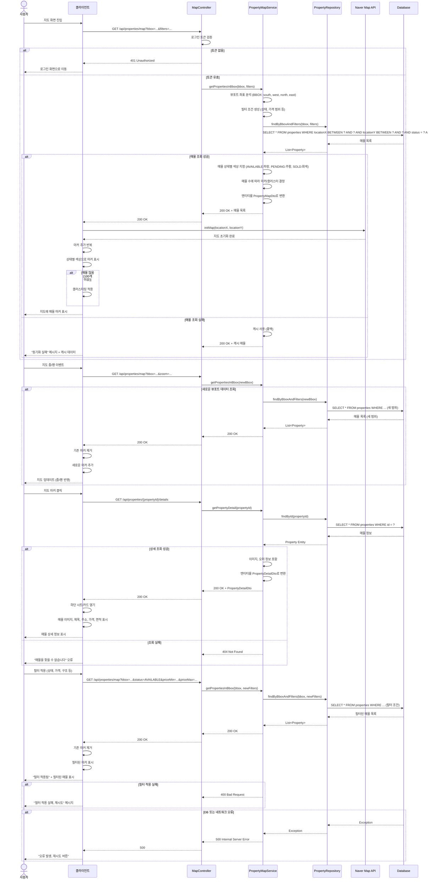
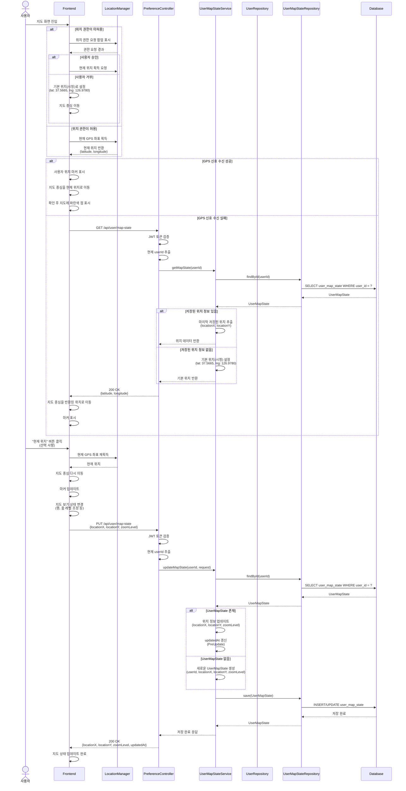
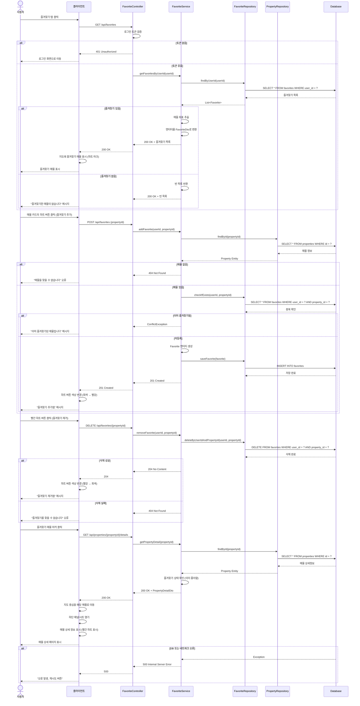
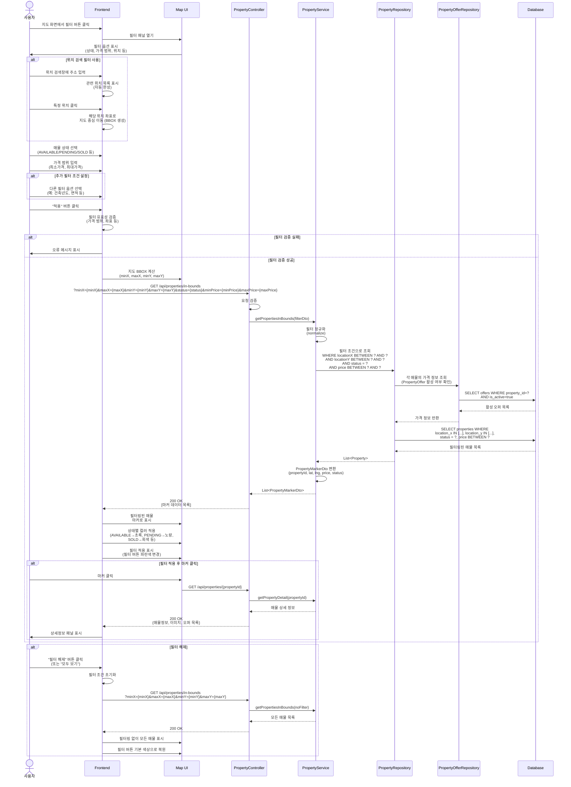
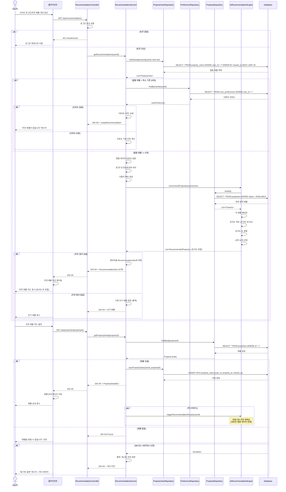

# 동근 26번

```mermaid
sequenceDiagram
    actor User as 사용자
    participant UI as 클라이언트
    participant Controller as MapController
    participant Service as PropertyMapService
    participant Repository as PropertyRepository
    participant MapAPI as Naver Map API
    participant DB as Database

    User->>UI: 지도 화면 진입
    UI->>Controller: GET /api/properties/map?bbox=...&filters=...
    
    Controller->>Controller: 로그인 토큰 검증
    alt 토큰 없음
        Controller-->>UI: 401 Unauthorized
        UI-->>User: 로그인 화면으로 이동
    else 토큰 유효
        Controller->>Service: getPropertiesInBbox(bbox, filters)
        
        Service->>Service: 뷰포트 좌표 분석 (BBOX: south, west, north, east)
        Service->>Service: 필터 조건 생성 (상태, 가격 범위 등)
        
        Service->>Repository: findByBboxAndFilters(bbox, filters)
        Repository->>DB: SELECT * FROM properties WHERE locationX BETWEEN ? AND ? AND locationY BETWEEN ? AND ? AND status = ? AND price BETWEEN ? AND ?
        DB-->>Repository: 매물 목록
        Repository-->>Service: List<Property>
        
        alt 매물 조회 성공
            Service->>Service: 매물 상태별 색상 지정 (AVAILABLE:파랑, PENDING:주황, SOLD:회색)
            Service->>Service: 매물 수에 따라 마커/클러스터 결정
            Service->>Service: 엔티티를 PropertyMapDto로 변환
            Service-->>Controller: 200 OK + 매물 목록
            
            Controller-->>UI: 200 OK
            UI->>MapAPI: initMap(locationX, locationY)
            MapAPI-->>UI: 지도 초기화 완료
            
            UI->>UI: 마커 추가 반복
            UI->>UI: 상태별 색상으로 마커 표시
            alt 매물 많음 (100개 이상)
                UI->>UI: 클러스터링 적용
            end
            UI-->>User: 지도에 매물 마커 표시
            
        else 매물 조회 실패
            Service->>Service: 캐시 사용 (폴백)
            Service-->>Controller: 200 OK + 캐시 매물
            UI-->>User: "동기화 실패" 메시지 + 캐시 데이터
        end
    end

    User->>UI: 지도 줌/팬 이벤트
    UI->>Controller: GET /api/properties/map?bbox=...&zoom=...
    
    Controller->>Service: getPropertiesInBbox(newBbox)
    
    alt 새로운 뷰포트 데이터 조회
        Service->>Repository: findByBboxAndFilters(newBbox)
        Repository->>DB: SELECT * FROM properties WHERE ... (새 범위)
        DB-->>Repository: 매물 목록 (새 범위)
        Repository-->>Service: List<Property>
        
        Service-->>Controller: 200 OK
        Controller-->>UI: 200 OK
        UI->>UI: 기존 마커 제거
        UI->>UI: 새로운 마커 추가
        UI-->>User: 지도 업데이트 (줌/팬 반영)
    end

    User->>UI: 지도 마커 클릭
    UI->>Controller: GET /api/properties/{propertyId}/details
    
    Controller->>Service: getPropertyDetail(propertyId)
    
    Service->>Repository: findById(propertyId)
    Repository->>DB: SELECT * FROM properties WHERE id = ?
    DB-->>Repository: 매물 정보
    Repository-->>Service: Property Entity
    
    alt 상세 조회 성공
        Service->>Service: 이미지, 오퍼 정보 포함
        Service->>Service: 엔티티를 PropertyDetailDto로 변환
        Service-->>Controller: 200 OK + PropertyDetailDto
        
        Controller-->>UI: 200 OK
        UI->>UI: 하단 시트/카드 열기
        UI->>UI: 매물 이미지, 제목, 주소, 가격, 면적 표시
        UI-->>User: 매물 상세 정보 표시
        
    else 조회 실패
        Service-->>Controller: 404 Not Found
        UI-->>User: "매물을 찾을 수 없습니다" 오류
    end

    User->>UI: 필터 적용 (상태, 가격, 구조 등)
    UI->>Controller: GET /api/properties/map?bbox=...&status=AVAILABLE&priceMin=...&priceMax=...
    
    Controller->>Service: getPropertiesInBbox(bbox, newFilters)
    
    Service->>Repository: findByBboxAndFilters(bbox, newFilters)
    Repository->>DB: SELECT * FROM properties WHERE ... (필터 조건)
    DB-->>Repository: 필터된 매물 목록
    Repository-->>Service: List<Property>
    
    Service-->>Controller: 200 OK
    Controller-->>UI: 200 OK
    UI->>UI: 기존 마커 제거
    UI->>UI: 필터된 마커 표시
    UI-->>User: "필터 적용됨" + 필터된 매물 표시

    alt 필터 적용 실패
        Service-->>Controller: 400 Bad Request
        UI-->>User: "필터 적용 실패, 재시도" 메시지
    end

    alt DB 또는 네트워크 오류
        DB-->>Repository: Exception
        Repository-->>Service: Exception
        Service-->>Controller: 500 Internal Server Error
        Controller-->>UI: 500
        UI-->>User: "오류 발생, 재시도 버튼"
    end

```

# 동근 27번

```mermaid
sequenceDiagram
    actor User as 사용자
    participant UI as Frontend
    participant LocationManager as LocationManager
    participant Controller as PreferenceController
    participant Service as UserMapStateService
    participant UserRepo as UserRepository
    participant MapStateRepo as UserMapStateRepository
    participant DB as Database

    User->>UI: 지도 화면 진입
    
    alt 위치 권한이 미허용
        UI->>LocationManager: 위치 권한 요청 팝업 표시
        LocationManager-->>UI: 권한 요청 결과
        
        alt 사용자 승인
            UI->>LocationManager: 현재 위치 획득 요청
        else 사용자 거부
            UI->>UI: 기본 위치(시청)로 설정<br/>(lat: 37.5665, lng: 126.9780)
            UI->>UI: 지도 중심 이동
        end
    else 위치 권한이 허용
        UI->>LocationManager: 현재 GPS 좌표 획득
        LocationManager-->>UI: 현재 위치 반환<br/>(latitude, longitude)
    end
    
    alt GPS 신호 수신 성공
        UI->>UI: 사용자 위치 마커 표시
        UI->>UI: 지도 중심을 현재 위치로 이동
        UI->>UI: 확인 후 지도에 파란색 점 표시
    else GPS 신호 수신 실패
        UI->>Controller: GET /api/user/map-state
        
        Controller->>Controller: JWT 토큰 검증
        Controller->>Controller: 현재 userId 추출
        
        Controller->>Service: getMapState(userId)
        
        Service->>MapStateRepo: findById(userId)
        MapStateRepo->>DB: SELECT user_map_state WHERE user_id = ?
        DB-->>MapStateRepo: UserMapState
        MapStateRepo-->>Service: UserMapState
        
        alt 저장된 위치 정보 있음
            Service->>Service: 마지막 저장된 위치 추출<br/>(locationX, locationY)
            Service-->>Controller: 위치 데이터 반환
        else 저장된 위치 정보 없음
            Service->>Service: 기본 위치(시청) 설정<br/>(lat: 37.5665, lng: 126.9780)
            Service-->>Controller: 기본 위치 반환
        end
        
        Controller-->>UI: 200 OK<br/>{latitude, longitude}
        
        UI->>UI: 지도 중심을 반환된 위치로 이동
        UI->>UI: 마커 표시
    end
    
    User->>UI: "현재 위치" 버튼 클릭<br/>(선택 사항)
    
    UI->>LocationManager: 현재 GPS 좌표 재획득
    LocationManager-->>UI: 현재 위치
    
    UI->>UI: 지도 중심 다시 이동
    UI->>UI: 마커 업데이트
    
    UI->>UI: 지도 보기 상태 변경<br/>(팬, 줌 레벨 조정 등)
    
    UI->>Controller: PUT /api/user/map-state<br/>{locationX, locationY, zoomLevel}
    
    Controller->>Controller: JWT 토큰 검증
    Controller->>Controller: 현재 userId 추출
    
    Controller->>Service: updateMapState(userId, request)
    
    Service->>MapStateRepo: findById(userId)
    MapStateRepo->>DB: SELECT user_map_state WHERE user_id = ?
    DB-->>MapStateRepo: UserMapState
    MapStateRepo-->>Service: UserMapState
    
    alt UserMapState 존재
        Service->>Service: 위치 정보 업데이트<br/>(locationX, locationY, zoomLevel)
        Service->>Service: updatedAt 갱신<br/>(PreUpdate)
    else UserMapState 없음
        Service->>Service: 새로운 UserMapState 생성<br/>(userId, locationX, locationY, zoomLevel)
    end
    
    Service->>MapStateRepo: save(UserMapState)
    MapStateRepo->>DB: INSERT/UPDATE user_map_state
    DB-->>MapStateRepo: 저장 완료
    MapStateRepo-->>Service: UserMapState
    
    Service-->>Controller: 저장 완료 응답
    
    Controller-->>UI: 200 OK<br/>{locationX, locationY, zoomLevel, updatedAt}
    
    UI->>UI: 지도 상태 업데이트 완료

```

# 동근 28번

```mermaid
sequenceDiagram
    actor User as 사용자
    participant UI as 클라이언트
    participant Controller as FavoriteController
    participant Service as FavoriteService
    participant FavoriteRepo as FavoriteRepository
    participant PropertyRepo as PropertyRepository
    participant DB as Database

    User->>UI: 즐겨찾기 탭 클릭
    UI->>Controller: GET /api/favorites
    
    Controller->>Controller: 로그인 토큰 검증
    alt 토큰 없음
        Controller-->>UI: 401 Unauthorized
        UI-->>User: 로그인 화면으로 이동
    else 토큰 유효
        Controller->>Service: getFavoritesByUserId(userId)
        
        Service->>FavoriteRepo: findByUserId(userId)
        FavoriteRepo->>DB: SELECT * FROM favorites WHERE user_id = ?
        DB-->>FavoriteRepo: 즐겨찾기 목록
        FavoriteRepo-->>Service: List<Favorite>
        
        alt 즐겨찾기 있음
            Service->>Service: 매물 좌표 추출
            Service->>Service: 엔티티를 FavoriteDto로 변환
            Service-->>Controller: 200 OK + 즐겨찾기 목록
            
            Controller-->>UI: 200 OK
            UI->>UI: 지도에 즐겨찾기 매물 표시 (하트 마크)
            UI-->>User: 즐겨찾기 매물 표시
            
        else 즐겨찾기 없음
            Service->>Service: 빈 목록 반환
            Service-->>Controller: 200 OK + 빈 목록
            UI-->>User: "즐겨찾기한 매물이 없습니다" 메시지
        end
    end

    User->>UI: 매물 카드의 하트 버튼 클릭 (즐겨찾기 추가)
    UI->>Controller: POST /api/favorites (propertyId)
    
    Controller->>Service: addFavorite(userId, propertyId)
    
    Service->>PropertyRepo: findById(propertyId)
    PropertyRepo->>DB: SELECT * FROM properties WHERE id = ?
    DB-->>PropertyRepo: 매물 정보
    PropertyRepo-->>Service: Property Entity
    
    alt 매물 없음
        Service-->>Controller: 404 Not Found
        UI-->>User: "매물을 찾을 수 없습니다" 오류
    else 매물 있음
        Service->>FavoriteRepo: checkIfExists(userId, propertyId)
        FavoriteRepo->>DB: SELECT * FROM favorites WHERE user_id = ? AND property_id = ?
        DB-->>FavoriteRepo: 중복 확인
        
        alt 이미 즐겨찾기됨
            Service-->>Controller: ConflictException
            UI-->>User: "이미 즐겨찾기된 매물입니다" 메시지
        else 미등록
            Service->>Service: Favorite 엔티티 생성
            Service->>FavoriteRepo: saveFavorite(favorite)
            FavoriteRepo->>DB: INSERT INTO favorites
            DB-->>FavoriteRepo: 저장 완료
            
            Service-->>Controller: 201 Created
            Controller-->>UI: 201 Created
            UI->>UI: 하트 버튼 색상 변경 (회색 → 빨강)
            UI-->>User: "즐겨찾기 추가됨" 메시지
        end
    end

    User->>UI: 빨간 하트 버튼 클릭 (즐겨찾기 제거)
    UI->>Controller: DELETE /api/favorites/{propertyId}
    
    Controller->>Service: removeFavorite(userId, propertyId)
    
    Service->>FavoriteRepo: deleteByUserIdAndPropertyId(userId, propertyId)
    FavoriteRepo->>DB: DELETE FROM favorites WHERE user_id = ? AND property_id = ?
    DB-->>FavoriteRepo: 삭제 완료
    
    alt 삭제 성공
        Service-->>Controller: 204 No Content
        Controller-->>UI: 204
        UI->>UI: 하트 버튼 색상 변경 (빨강 → 회색)
        UI-->>User: "즐겨찾기 제거됨" 메시지
    else 삭제 실패
        Service-->>Controller: 404 Not Found
        UI-->>User: "즐겨찾기를 찾을 수 없습니다" 오류
    end

    User->>UI: 즐겨찾기 매물 마커 클릭
    UI->>Controller: GET /api/properties/{propertyId}/details
    
    Controller->>Service: getPropertyDetail(propertyId)
    
    Service->>PropertyRepo: findById(propertyId)
    PropertyRepo->>DB: SELECT * FROM properties WHERE id = ?
    DB-->>PropertyRepo: 매물 상세정보
    PropertyRepo-->>Service: Property Entity
    
    Service->>Service: 즐겨찾기 상태 확인 (이미 좋아함)
    Service-->>Controller: 200 OK + PropertyDetailDto
    
    Controller-->>UI: 200 OK
    UI->>UI: 지도 중심을 해당 매물로 이동
    UI->>UI: 하단 패널/시트 열기
    UI->>UI: 매물 상세 정보 표시 (빨간 하트 표시)
    UI-->>User: 매물 상세 페이지 표시

    alt DB 또는 네트워크 오류
        DB-->>Service: Exception
        Service-->>Controller: 500 Internal Server Error
        Controller-->>UI: 500
        UI-->>User: "오류 발생, 재시도 버튼"
    end

```

# 동근 30번

```mermaid
sequenceDiagram
    actor User as 사용자
    participant UI as Frontend
    participant MapComponent as Map UI
    participant Controller as PropertyController
    participant Service as PropertyService
    participant PropertyRepo as PropertyRepository
    participant PropertyOfferRepo as PropertyOfferRepository
    participant DB as Database

    User->>UI: 지도 화면에서 필터 버튼 클릭
    
    UI->>MapComponent: 필터 패널 열기
    MapComponent->>User: 필터 옵션 표시<br/>(상태, 가격 범위, 위치 등)
    
    alt 위치 검색 필터 사용
        User->>UI: 위치 검색창에 주소 입력
        
        UI->>UI: 관련 위치 목록 표시<br/>(자동 완성)
        
        User->>UI: 특정 위치 클릭
        
        UI->>UI: 해당 위치 좌표로<br/>지도 중심 이동 (BBOX 생성)
    end
    
    User->>UI: 매물 상태 선택<br/>(AVAILABLE/PENDING/SOLD 등)
    
    User->>UI: 가격 범위 입력<br/>(최소가격, 최대가격)
    
    alt 추가 필터 조건 설정
        User->>UI: 다른 필터 옵션 선택<br/>(예: 건축년도, 면적 등)
    end
    
    User->>UI: "적용" 버튼 클릭
    
    UI->>UI: 필터 유효성 검증<br/>(가격 범위, 좌표 등)
    
    alt 필터 검증 실패
        UI->>User: 오류 메시지 표시
    else 필터 검증 성공
        UI->>MapComponent: 지도 BBOX 계산<br/>(minX, maxX, minY, maxY)
        
        UI->>Controller: GET /api/properties/in-bounds<br/>?minX={minX}&maxX={maxX}&minY={minY}&maxY={maxY}&status={status}&minPrice={minPrice}&maxPrice={maxPrice}
        
        Controller->>Controller: 요청 검증
        
        Controller->>Service: getPropertiesInBounds(filterDto)
        
        Service->>Service: 필터 정규화<br/>(normalize)
        
        Service->>PropertyRepo: 필터 조건으로 조회<br/>WHERE locationX BETWEEN ? AND ?<br/>AND locationY BETWEEN ? AND ?<br/>AND status = ?<br/>AND price BETWEEN ? AND ?
        
        PropertyRepo->>PropertyOfferRepo: 각 매물의 가격 정보 조회<br/>(PropertyOffer 활성 여부 확인)
        PropertyOfferRepo->>DB: SELECT offers WHERE property_id=?<br/>AND is_active=true
        DB-->>PropertyOfferRepo: 활성 오퍼 목록
        PropertyOfferRepo-->>PropertyRepo: 가격 정보 반환
        
        PropertyRepo->>DB: SELECT properties WHERE<br/>location_x IN [...], location_y IN [...],<br/>status = ?, price BETWEEN ?
        DB-->>PropertyRepo: 필터링된 매물 목록
        PropertyRepo-->>Service: List<Property>
        
        Service->>Service: PropertyMarkerDto 변환<br/>(propertyId, lat, lng, price, status)
        
        Service-->>Controller: List<PropertyMarkerDto>
        
        Controller-->>UI: 200 OK<br/>[마커 데이터 목록]
        
        UI->>MapComponent: 필터링된 매물<br/>마커로 표시
        
        UI->>MapComponent: 상태별 컬러 적용<br/>(AVAILABLE→초록, PENDING→노랑,<br/>SOLD→회색 등)
        
        UI->>MapComponent: 필터 적용 표시<br/>(필터 버튼 파란색 변경)
        
        alt 필터 적용 후 마커 클릭
            User->>MapComponent: 마커 클릭
            
            MapComponent->>Controller: GET /api/properties/{propertyId}
            
            Controller->>Service: getPropertyDetail(propertyId)
            Service-->>Controller: 매물 상세 정보
            Controller-->>UI: 200 OK<br/>{매물정보, 이미지, 오퍼 목록}
            
            UI->>User: 상세정보 패널 표시
        end
    end
    
    alt 필터 해제
        User->>UI: "필터 해제" 버튼 클릭<br/>(또는 "모두 보기")
        
        UI->>UI: 필터 조건 초기화
        
        UI->>Controller: GET /api/properties/in-bounds<br/>?minX={minX}&maxX={maxX}&minY={minY}&maxY={maxY}
        
        Controller->>Service: getPropertiesInBounds(noFilter)
        Service-->>Controller: 모든 매물 목록
        Controller-->>UI: 200 OK
        
        UI->>MapComponent: 필터링 없이 모든 매물 표시
        
        UI->>MapComponent: 필터 버튼 기본 색상으로 복원
    end

```

# 동근 34번

```mermaid
sequenceDiagram
    actor User as 사용자
    participant UI as 클라이언트
    participant Controller as RecommendationController
    participant Service as RecommendationService
    participant ViewRepository as PropertyViewRepository
    participant PreferenceRepository as PreferenceRepository
    participant PropertyRepository as PropertyRepository
    participant AIEngine as AIRecommendationEngine
    participant DB as Database

    User->>UI: 사이트 로그인/추천 매물 섹션 접근
    UI->>Controller: GET /api/recommendations
    
    Controller->>Controller: 로그인 토큰 검증
    alt 토큰 없음
        Controller-->>UI: 401 Unauthorized
        UI-->>User: 로그인 화면으로 이동
    else 토큰 유효
        Controller->>Service: getRecommendations(userId)
        
        Service->>ViewRepository: findViewsByUserId(userId, limit=20)
        ViewRepository->>DB: SELECT * FROM property_views WHERE user_id = ? ORDER BY viewed_at DESC LIMIT 20
        DB-->>ViewRepository: 열람 매물 목록
        ViewRepository-->>Service: List<PropertyView>
        
        alt 열람 매물 < 최소 기준 (5개)
            Service->>PreferenceRepository: findByUserId(userId)
            PreferenceRepository->>DB: SELECT * FROM user_preferences WHERE user_id = ?
            DB-->>PreferenceRepository: 사용자 선호도
            PreferenceRepository-->>Service: UserPreference
            
            alt 선호도 없음
                Service->>Service: "데이터 부족" 상태
                Service-->>Controller: 200 OK + emptyRecommendation
                UI-->>User: "추천 매물이 없습니다" 메시지
            else 선호도 있음
                Service->>Service: 선호도 기반 추천 계산
            end
        else 열람 매물 >= 5개
            Service->>Service: 열람 데이터 유효성 검증
            Service->>Service: 원-핫 인코딩/정규화 처리
            Service->>Service: 사용자 벡터 생성
            
            Service->>AIEngine: recommendProperties(userVector)
            
            AIEngine->>PropertyRepository: findAll()
            PropertyRepository->>DB: SELECT * FROM properties WHERE status = AVAILABLE
            DB-->>PropertyRepository: 전체 공개 매물
            PropertyRepository-->>AIEngine: List<Property>
            
            AIEngine->>AIEngine: 각 매물 벡터화
            AIEngine->>AIEngine: 유사도 계산 (코사인 유사도)
            AIEngine->>AIEngine: 유사도 순 정렬
            AIEngine->>AIEngine: 상위 10개 선택
            AIEngine-->>Service: List<RecommendedProperty> (유사도 포함)
            
            alt 추천 결과 있음
                Service->>Service: 엔티티를 RecommendationDto로 변환
                Service-->>Controller: 200 OK + RecommendationDto (10개)
                
                Controller-->>UI: 200 OK
                UI->>UI: 추천 매물 섹션 렌더링
                UI-->>User: 추천 매물 카드 표시 (유사도 바 포함)
            else 추천 결과 없음
                Service->>Service: 기본 인기 매물 반환 (폴백)
                Service-->>Controller: 200 OK + 인기 매물
                UI-->>User: 인기 매물 표시
            end
        end
    end

    User->>UI: 추천 매물 카드 클릭
    UI->>Controller: GET /api/properties/{propertyId}
    
    Controller->>Service: getPropertyDetail(propertyId)
    Service->>PropertyRepository: findById(propertyId)
    PropertyRepository->>DB: SELECT * FROM properties WHERE id = ?
    DB-->>PropertyRepository: 매물 정보
    PropertyRepository-->>Service: Property Entity
    
    alt 매물 있음
        Service->>ViewRepository: savePropertyView(userId, propertyId)
        ViewRepository->>DB: INSERT INTO property_views (user_id, property_id, viewed_at)
        DB-->>ViewRepository: 저장 완료
        
        Service-->>Controller: 200 OK + PropertyDetailDto
        Controller-->>UI: 200 OK
        UI->>UI: 매물 상세 페이지 이동
        UI-->>User: 매물 상세 표시
        
        par 백그라운드
            Service->>AIEngine: triggerRecommendationRecalc(userId)
            Note over AIEngine: 비동기로 추천 재계산<br/>(새로운 열람 데이터 반영)
        end
    else 매물 없음
        Service-->>Controller: 404 Not Found
        UI-->>User: "매물을 찾을 수 없습니다" 오류
    end

    alt DB 또는 네트워크 오류
        DB-->>Service: Exception
        Service->>Service: 폴백: 캐시된 추천 반환
        Service-->>Controller: 200 OK + 캐시 추천
        UI-->>User: "동기화 실패" 메시지 + 캐시 데이터
    end

```

