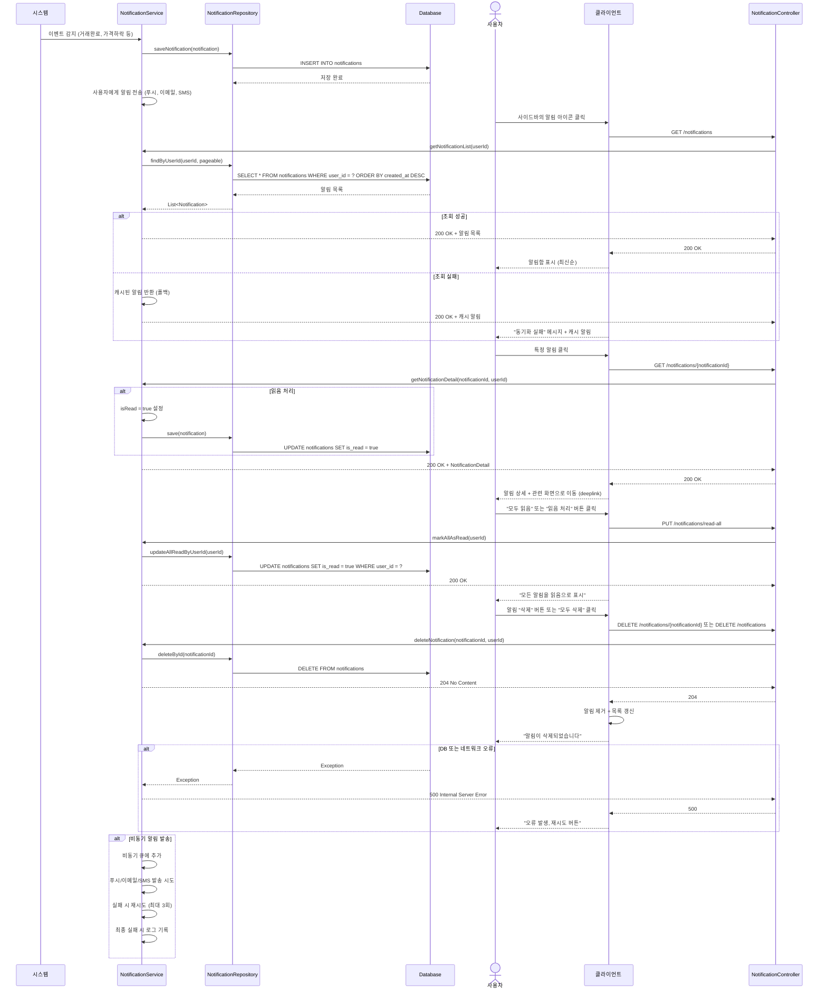
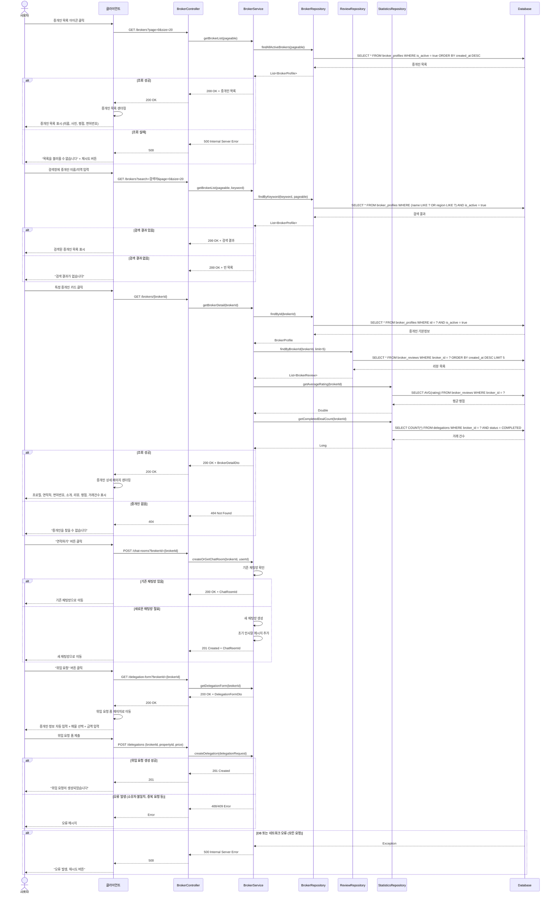
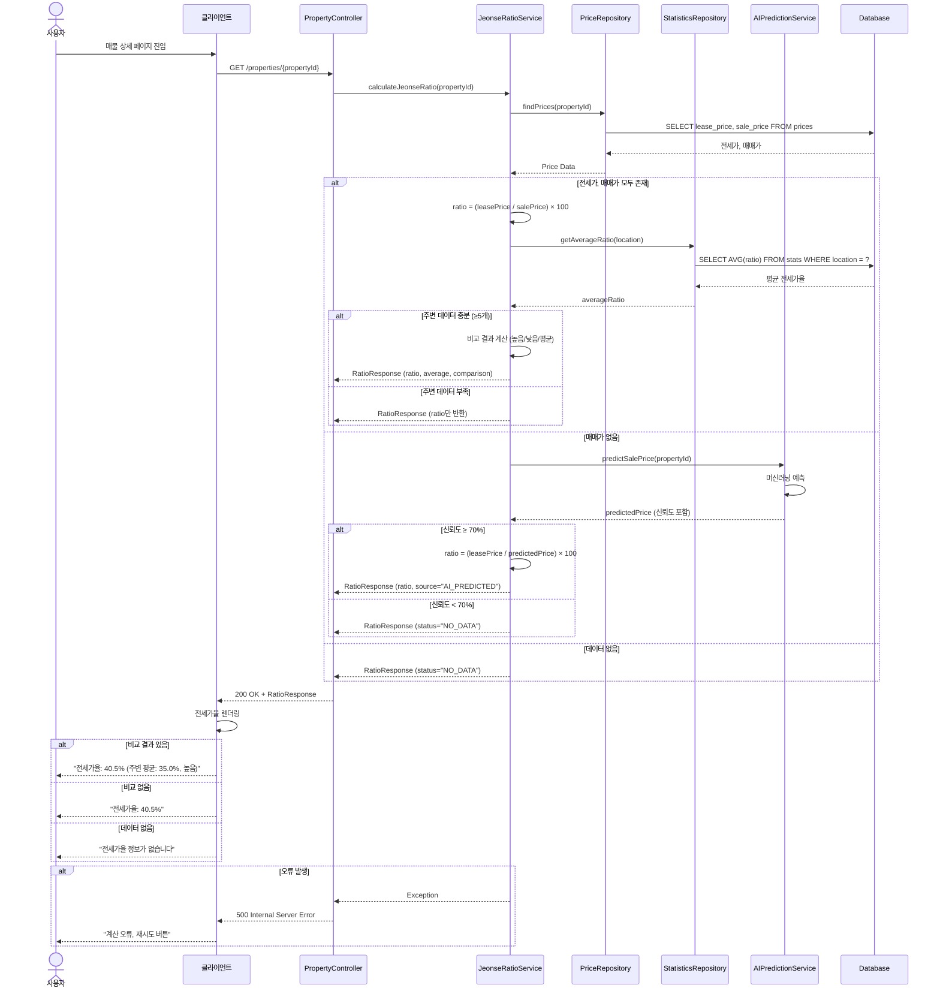

# 진우 23번

```mermaid
sequenceDiagram
    actor Owner as 소유자
    actor Broker as 브로커
    participant UI as 클라이언트
    participant Controller as DelegationController
    participant Service as DelegationService
    participant DelegRepo as DelegationRepository
    participant PropertyRepo as PropertyRepository
    participant DB as Database

    Owner->>UI: 매물 상세화면 진입
    UI->>Controller: GET /properties/{propertyId}
    
    Owner->>UI: "브로커 위임 요청" 버튼 클릭
    UI->>Controller: POST /delegations (propertyId, brokerId, dealType, price)
    
    Controller->>Service: createDelegation(owner, propertyId, brokerId)
    
    Service->>PropertyRepo: findById(propertyId)
    PropertyRepo->>DB: SELECT * FROM properties
    DB-->>PropertyRepo: Property
    PropertyRepo-->>Service: Property
    
    alt 소유자 확인
        Service->>Service: property.ownerId == owner.id?
        alt 소유자 불일치
            Service-->>Controller: UnauthorizedException
            Controller-->>UI: 403
            UI-->>Owner: "소유자만 위임 가능"
        else 소유자 일치
            Service->>DelegRepo: checkPending(propertyId)
            DelegRepo->>DB: SELECT * FROM delegations WHERE property_id = ? AND status = PENDING
            DB-->>DelegRepo: 기존 요청
            
            alt PENDING 요청 존재
                Service-->>Controller: ConflictException
                Controller-->>UI: 409
                UI-->>Owner: "이미 요청 진행 중"
            else PENDING 요청 없음
                Service->>Service: 위임 요청 생성 (status=PENDING)
                Service->>DelegRepo: saveDelegation(delegation)
                DelegRepo->>DB: INSERT INTO delegations
                DB-->>DelegRepo: 저장 완료
                Service-->>Controller: 201 Created
                Controller-->>UI: 201
                UI-->>Owner: "위임 요청 생성됨"
            end
        end
    end

    Broker->>UI: 위임 요청 목록 조회
    UI->>Controller: GET /delegations/received
    
    Controller->>Service: getReceivedDelegations(brokerId)
    Service->>DelegRepo: findByBrokerId(brokerId)
    DelegRepo->>DB: SELECT * FROM delegations WHERE broker_id = ? AND status = PENDING
    DB-->>DelegRepo: 요청 목록
    DelegRepo-->>Service: List<Delegation>
    Service-->>Controller: 200 OK
    Controller-->>UI: 200
    UI-->>Broker: 위임 요청 목록 표시

    Broker->>UI: 요청 승인 버튼 클릭
    UI->>Controller: PATCH /delegations/{id}/approve
    
    Controller->>Service: approveDelegation(delegationId, brokerId)
    
    Service->>DelegRepo: findById(delegationId)
    DelegRepo->>DB: SELECT * FROM delegations WHERE id = ?
    DB-->>DelegRepo: Delegation
    DelegRepo-->>Service: Delegation
    
    alt 상태 확인
        Service->>Service: status == PENDING?
        alt PENDING 아님
            Service-->>Controller: InvalidStateException
            Controller-->>UI: 400
        else PENDING
            Service->>Service: status = ACCEPTED
            Service->>DelegRepo: save(delegation)
            DelegRepo->>DB: UPDATE delegations SET status = ACCEPTED
            DB-->>DelegRepo: 완료
            Service-->>Controller: 200 OK
            Controller-->>UI: 200
            UI-->>Broker: "승인 완료"
            UI-->>Owner: 알림 "위임 요청 승인됨"
        end
    end

    Broker->>UI: 요청 거절 버튼 클릭 (사유 입력)
    UI->>Controller: PATCH /delegations/{id}/reject (reason)
    
    Controller->>Service: rejectDelegation(delegationId, reason)
    
    Service->>Service: status = REJECTED, reason 설정
    Service->>DelegRepo: save(delegation)
    DelegRepo->>DB: UPDATE delegations SET status = REJECTED, reason = ?
    DB-->>DelegRepo: 완료
    Service-->>Controller: 200 OK
    Controller-->>UI: 200
    UI-->>Broker: "거절 완료"
    UI-->>Owner: 알림 "위임 요청 거절됨: {사유}"

    Owner->>UI: 보낸 요청 목록에서 PENDING 요청 취소
    UI->>Controller: PATCH /delegations/{id}/cancel
    
    Controller->>Service: cancelDelegation(delegationId, owner)
    
    Service->>Service: 소유자 확인 + status = PENDING 확인
    Service->>Service: status = CANCELLED
    Service->>DelegRepo: save(delegation)
    DelegRepo->>DB: UPDATE delegations SET status = CANCELLED
    Service-->>Controller: 200 OK
    UI-->>Owner: "요청 취소됨"
    UI-->>Broker: 알림 "위임 요청이 취소됨"

    Owner->>UI: 완료된 요청 삭제 (REJECTED/CANCELLED만)
    UI->>Controller: DELETE /delegations/{id}
    
    Controller->>Service: deleteDelegation(delegationId, owner)
    
    Service->>Service: status == ACCEPTED?
    alt ACCEPTED
        Service-->>Controller: 400 Bad Request
        UI-->>Owner: "ACCEPTED 요청은 삭제 불가"
    else REJECTED/CANCELLED
        Service->>DelegRepo: deleteById(delegationId)
        DelegRepo->>DB: DELETE FROM delegations
        Service-->>Controller: 204 No Content
        UI-->>Owner: "삭제 완료"
    end

    alt DB 또는 네트워크 오류
        DB-->>DelegRepo: Exception
        DelegRepo-->>Service: DatabaseException
        Service-->>Controller: 500 Internal Server Error
        Controller-->>UI: 500
        UI-->>Owner: "오류 발생, 재시도"
    end

```

# 진우 24번

```mermaid
sequenceDiagram
    participant System as 시스템
    participant Service as NotificationService
    participant Repository as NotificationRepository
    participant DB as Database
    actor User as 사용자
    participant UI as 클라이언트
    participant Controller as NotificationController

    System->>Service: 이벤트 감지 (거래완료, 가격하락 등)
    
    Service->>Repository: saveNotification(notification)
    Repository->>DB: INSERT INTO notifications
    DB-->>Repository: 저장 완료
    
    Service->>Service: 사용자에게 알림 전송 (푸시, 이메일, SMS)

    User->>UI: 사이드바의 알림 아이콘 클릭
    UI->>Controller: GET /notifications
    
    Controller->>Service: getNotificationList(userId)
    
    Service->>Repository: findByUserId(userId, pageable)
    Repository->>DB: SELECT * FROM notifications WHERE user_id = ? ORDER BY created_at DESC
    DB-->>Repository: 알림 목록
    Repository-->>Service: List<Notification>
    
    alt 조회 성공
        Service-->>Controller: 200 OK + 알림 목록
        Controller-->>UI: 200 OK
        UI-->>User: 알림함 표시 (최신순)
    else 조회 실패
        Service->>Service: 캐시된 알림 반환 (폴백)
        Service-->>Controller: 200 OK + 캐시 알림
        UI-->>User: "동기화 실패" 메시지 + 캐시 알림
    end

    User->>UI: 특정 알림 클릭
    UI->>Controller: GET /notifications/{notificationId}
    
    Controller->>Service: getNotificationDetail(notificationId, userId)
    
    alt 읽음 처리
        Service->>Service: isRead = true 설정
        Service->>Repository: save(notification)
        Repository->>DB: UPDATE notifications SET is_read = true
    end
    
    Service-->>Controller: 200 OK + NotificationDetail
    Controller-->>UI: 200 OK
    UI-->>User: 알림 상세 + 관련 화면으로 이동 (deeplink)

    User->>UI: "모두 읽음" 또는 "읽음 처리" 버튼 클릭
    UI->>Controller: PUT /notifications/read-all
    
    Controller->>Service: markAllAsRead(userId)
    
    Service->>Repository: updateAllReadByUserId(userId)
    Repository->>DB: UPDATE notifications SET is_read = true WHERE user_id = ?
    
    Service-->>Controller: 200 OK
    UI-->>User: "모든 알림을 읽음으로 표시"

    User->>UI: 알림 "삭제" 버튼 또는 "모두 삭제" 클릭
    UI->>Controller: DELETE /notifications/{notificationId} 또는 DELETE /notifications
    
    Controller->>Service: deleteNotification(notificationId, userId)
    
    Service->>Repository: deleteById(notificationId)
    Repository->>DB: DELETE FROM notifications
    
    Service-->>Controller: 204 No Content
    Controller-->>UI: 204
    UI->>UI: 알림 제거 + 목록 갱신
    UI-->>User: "알림이 삭제되었습니다"

    alt DB 또는 네트워크 오류
        DB-->>Repository: Exception
        Repository-->>Service: Exception
        Service-->>Controller: 500 Internal Server Error
        Controller-->>UI: 500
        UI-->>User: "오류 발생, 재시도 버튼"
    end

    alt 비동기 알림 발송
        Service->>Service: 비동기 큐에 추가
        Service->>Service: 푸시/이메일/SMS 발송 시도
        Service->>Service: 실패 시 재시도 (최대 3회)
        Service->>Service: 최종 실패 시 로그 기록
    end

```

# 진우 35번

```mermaid
sequenceDiagram
    actor User as 사용자
    participant UI as 클라이언트
    participant Controller as BrokerController
    participant Service as BrokerService
    participant BrokerRepo as BrokerRepository
    participant ReviewRepo as ReviewRepository
    participant StatRepo as StatisticsRepository
    participant DB as Database

    User->>UI: 중개인 목록 아이콘 클릭
    UI->>Controller: GET /brokers?page=0&size=20
    
    Controller->>Service: getBrokerList(pageable)
    
    Service->>BrokerRepo: findAllActiveBrokers(pageable)
    BrokerRepo->>DB: SELECT * FROM broker_profiles WHERE is_active = true ORDER BY created_at DESC
    DB-->>BrokerRepo: 중개인 목록
    BrokerRepo-->>Service: List<BrokerProfile>
    
    alt 조회 성공
        Service-->>Controller: 200 OK + 중개인 목록
        Controller-->>UI: 200 OK
        UI->>UI: 중개인 목록 렌더링
        UI-->>User: 중개인 목록 표시 (이름, 사진, 평점, 면허번호)
    else 조회 실패
        Service-->>Controller: 500 Internal Server Error
        Controller-->>UI: 500
        UI-->>User: "목록을 불러올 수 없습니다" + 재시도 버튼
    end

    User->>UI: 검색창에 중개인 이름/지역 입력
    UI->>Controller: GET /brokers?search=검색어&page=0&size=20
    
    Controller->>Service: getBrokerList(pageable, keyword)
    
    Service->>BrokerRepo: findByKeyword(keyword, pageable)
    BrokerRepo->>DB: SELECT * FROM broker_profiles WHERE (name LIKE ? OR region LIKE ?) AND is_active = true
    DB-->>BrokerRepo: 검색 결과
    BrokerRepo-->>Service: List<BrokerProfile>
    
    alt 검색 결과 있음
        Service-->>Controller: 200 OK + 검색 결과
        UI-->>User: 검색된 중개인 목록 표시
    else 검색 결과 없음
        Service-->>Controller: 200 OK + 빈 목록
        UI-->>User: "검색 결과가 없습니다"
    end

    User->>UI: 특정 중개인 카드 클릭
    UI->>Controller: GET /brokers/{brokerId}
    
    Controller->>Service: getBrokerDetail(brokerId)
    
    Service->>BrokerRepo: findById(brokerId)
    BrokerRepo->>DB: SELECT * FROM broker_profiles WHERE id = ? AND is_active = true
    DB-->>BrokerRepo: 중개인 기본정보
    BrokerRepo-->>Service: BrokerProfile
    
    Service->>ReviewRepo: findByBrokerId(brokerId, limit=5)
    ReviewRepo->>DB: SELECT * FROM broker_reviews WHERE broker_id = ? ORDER BY created_at DESC LIMIT 5
    DB-->>ReviewRepo: 리뷰 목록
    ReviewRepo-->>Service: List<BrokerReview>
    
    Service->>StatRepo: getAverageRating(brokerId)
    StatRepo->>DB: SELECT AVG(rating) FROM broker_reviews WHERE broker_id = ?
    DB-->>StatRepo: 평균 평점
    StatRepo-->>Service: Double
    
    Service->>StatRepo: getCompletedDealCount(brokerId)
    StatRepo->>DB: SELECT COUNT(*) FROM delegations WHERE broker_id = ? AND status = COMPLETED
    DB-->>StatRepo: 거래 건수
    StatRepo-->>Service: Long
    
    alt 조회 성공
        Service-->>Controller: 200 OK + BrokerDetailDto
        Controller-->>UI: 200 OK
        UI->>UI: 중개인 상세 페이지 렌더링
        UI-->>User: 프로필, 연락처, 면허번호, 소개, 리뷰, 평점, 거래건수 표시
    else 중개인 없음
        Service-->>Controller: 404 Not Found
        Controller-->>UI: 404
        UI-->>User: "중개인을 찾을 수 없습니다"
    end

    User->>UI: "연락하기" 버튼 클릭
    UI->>Controller: POST /chat-rooms?brokerId={brokerId}
    
    Controller->>Service: createOrGetChatRoom(brokerId, userId)
    
    Service->>Service: 기존 채팅방 확인
    alt 기존 채팅방 있음
        Service-->>Controller: 200 OK + ChatRoomId
        UI-->>User: 기존 채팅방으로 이동
    else 새로운 채팅방 필요
        Service->>Service: 새 채팅방 생성
        Service->>Service: 초기 인사말 메시지 추가
        Service-->>Controller: 201 Created + ChatRoomId
        UI-->>User: 새 채팅방으로 이동
    end

    User->>UI: "위임 요청" 버튼 클릭
    UI->>Controller: GET /delegation-form?brokerId={brokerId}
    
    Controller->>Service: getDelegationForm(brokerId)
    
    Service-->>Controller: 200 OK + DelegationFormDto
    Controller-->>UI: 200 OK
    UI->>UI: 위임 요청 폼 페이지로 이동
    UI-->>User: 중개인 정보 자동 입력 + 매물 선택 + 금액 입력

    User->>UI: 위임 요청 폼 제출
    UI->>Controller: POST /delegations (brokerId, propertyId, price)
    
    Controller->>Service: createDelegation(delegationRequest)
    
    alt 위임 요청 생성 성공
        Service-->>Controller: 201 Created
        Controller-->>UI: 201
        UI-->>User: "위임 요청이 생성되었습니다"
    else 오류 발생 (소유자 불일치, 중복 요청 등)
        Service-->>Controller: 400/409 Error
        Controller-->>UI: Error
        UI-->>User: 오류 메시지
    end

    alt DB 또는 네트워크 오류 (모든 요청)
        DB-->>Service: Exception
        Service-->>Controller: 500 Internal Server Error
        Controller-->>UI: 500
        UI-->>User: "오류 발생, 재시도 버튼"
    end

```

# 진우 38번

```mermaid
sequenceDiagram
    actor User as 사용자
    participant UI as 클라이언트
    participant Controller as PropertyController
    participant Service as JeonseRatioService
    participant PriceRepo as PriceRepository
    participant StatsRepo as StatisticsRepository
    participant AIService as AIPredictionService
    participant DB as Database

    User->>UI: 매물 상세 페이지 진입
    UI->>Controller: GET /properties/{propertyId}
    
    Controller->>Service: calculateJeonseRatio(propertyId)
    
    Service->>PriceRepo: findPrices(propertyId)
    PriceRepo->>DB: SELECT lease_price, sale_price FROM prices
    DB-->>PriceRepo: 전세가, 매매가
    PriceRepo-->>Service: Price Data
    
    alt 전세가, 매매가 모두 존재
        Service->>Service: ratio = (leasePrice / salePrice) × 100
        Service->>StatsRepo: getAverageRatio(location)
        StatsRepo->>DB: SELECT AVG(ratio) FROM stats WHERE location = ?
        DB-->>StatsRepo: 평균 전세가율
        StatsRepo-->>Service: averageRatio
        
        alt 주변 데이터 충분 (≥5개)
            Service->>Service: 비교 결과 계산 (높음/낮음/평균)
            Service-->>Controller: RatioResponse (ratio, average, comparison)
        else 주변 데이터 부족
            Service-->>Controller: RatioResponse (ratio만 반환)
        end
        
    else 매매가 없음
        Service->>AIService: predictSalePrice(propertyId)
        AIService->>AIService: 머신러닝 예측
        AIService-->>Service: predictedPrice (신뢰도 포함)
        
        alt 신뢰도 ≥ 70%
            Service->>Service: ratio = (leasePrice / predictedPrice) × 100
            Service-->>Controller: RatioResponse (ratio, source="AI_PREDICTED")
        else 신뢰도 < 70%
            Service-->>Controller: RatioResponse (status="NO_DATA")
        end
        
    else 데이터 없음
        Service-->>Controller: RatioResponse (status="NO_DATA")
    end
    
    Controller-->>UI: 200 OK + RatioResponse
    UI->>UI: 전세가율 렌더링
    alt 비교 결과 있음
        UI-->>User: "전세가율: 40.5% (주변 평균: 35.0%, 높음)"
    else 비교 없음
        UI-->>User: "전세가율: 40.5%"
    else 데이터 없음
        UI-->>User: "전세가율 정보가 없습니다"
    end

    alt 오류 발생
        Service-->>Controller: Exception
        Controller-->>UI: 500 Internal Server Error
        UI-->>User: "계산 오류, 재시도 버튼"
    end

```
