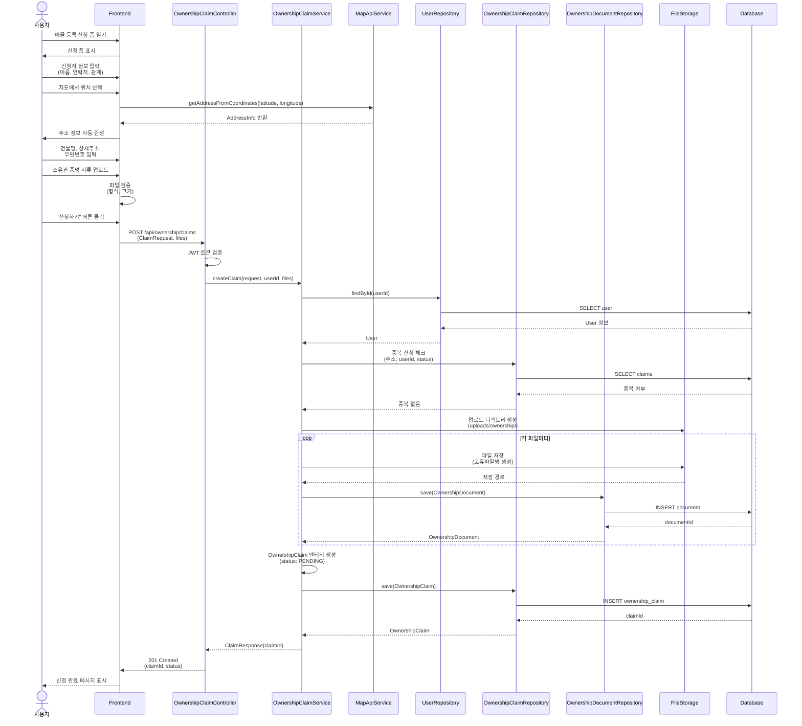
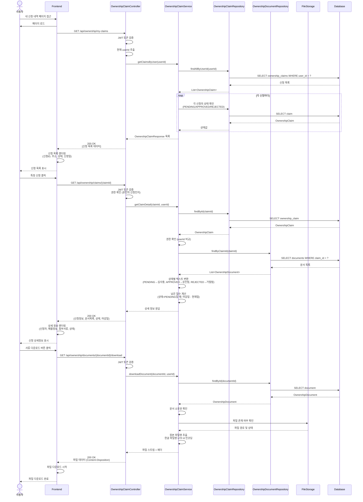
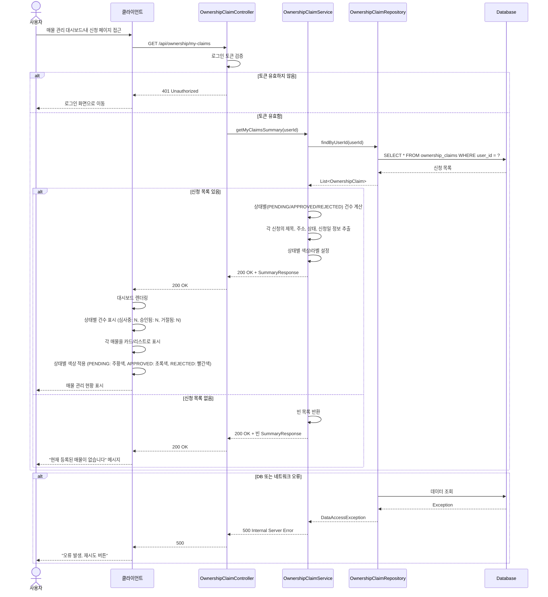
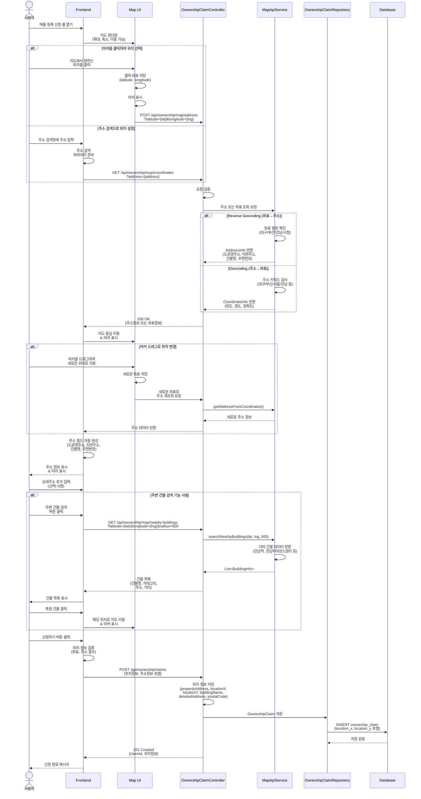
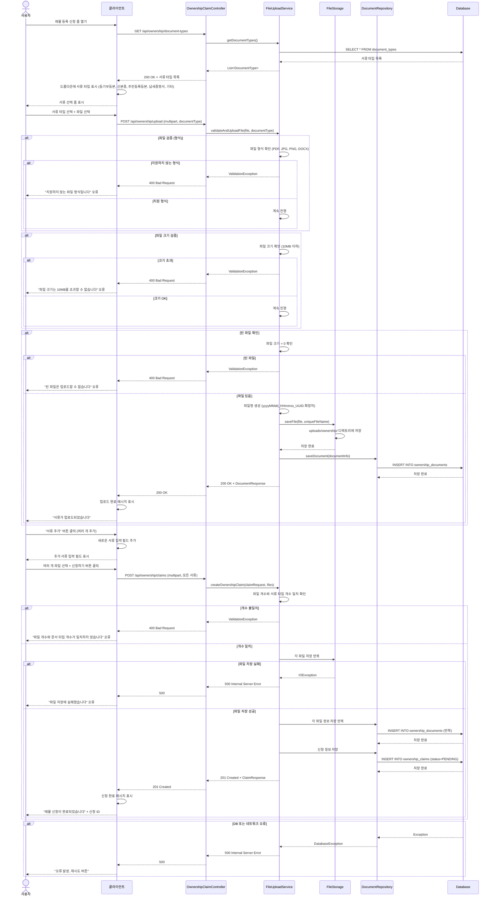
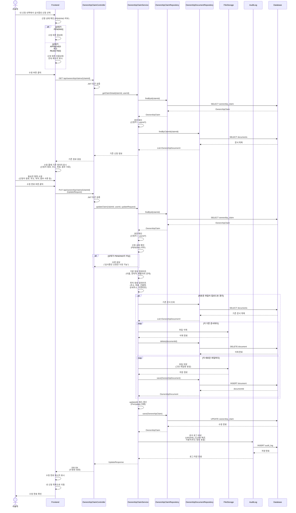
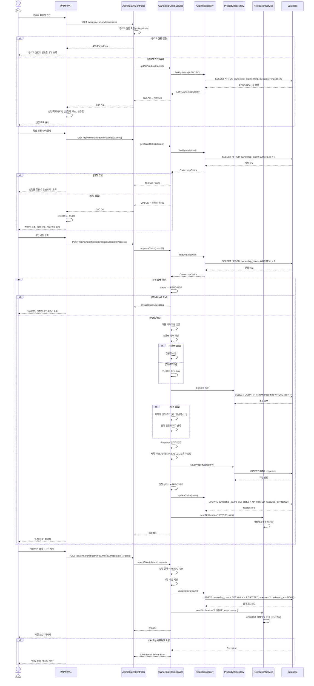
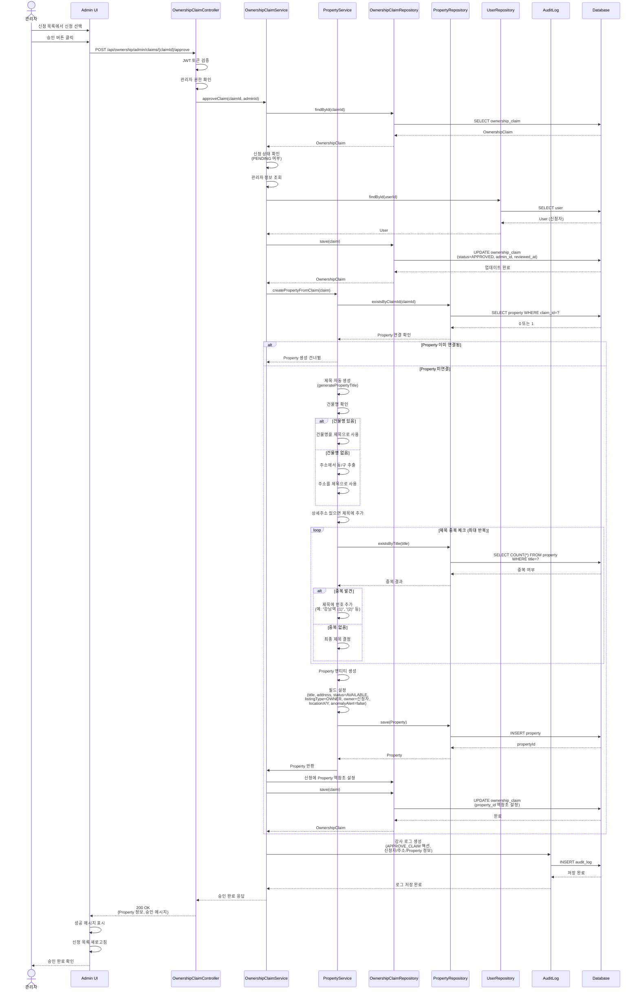

# 주원 1번

```mermaid
sequenceDiagram
    actor User as 사용자
    participant UI as Frontend
    participant Controller as OwnershipClaimController
    participant Service as OwnershipClaimService
    participant MapAPI as MapApiService
    participant UserRepo as UserRepository
    participant ClaimRepo as OwnershipClaimRepository
    participant DocRepo as OwnershipDocumentRepository
    participant FileStorage as FileStorage
    participant DB as Database

    User->>UI: 매물 등록 신청 폼 열기
    UI->>User: 신청 폼 표시
    
    User->>UI: 신청자 정보 입력<br/>(이름, 연락처, 관계)
    User->>UI: 지도에서 위치 선택
    
    UI->>MapAPI: getAddressFromCoordinates(latitude, longitude)
    MapAPI-->>UI: AddressInfo 반환
    UI->>User: 주소 정보 자동 완성
    
    User->>UI: 건물명, 상세주소,<br/>우편번호 입력
    User->>UI: 소유권 증명 서류 업로드
    
    UI->>UI: 파일 검증<br/>(형식, 크기)
    
    User->>UI: "신청하기" 버튼 클릭
    
    UI->>Controller: POST /api/ownership/claims<br/>(ClaimRequest, files)
    
    Controller->>Controller: JWT 토큰 검증
    
    Controller->>Service: createClaim(request, userId, files)
    
    Service->>UserRepo: findById(userId)
    UserRepo->>DB: SELECT user
    DB-->>UserRepo: User 정보
    UserRepo-->>Service: User
    
    Service->>ClaimRepo: 중복 신청 체크<br/>(주소, userId, status)
    ClaimRepo->>DB: SELECT claims
    DB-->>ClaimRepo: 중복 여부
    ClaimRepo-->>Service: 중복 없음
    
    Service->>FileStorage: 업로드 디렉토리 생성<br/>(uploads/ownership/)
    
    loop 각 파일마다
        Service->>FileStorage: 파일 저장<br/>(고유파일명 생성)
        FileStorage-->>Service: 저장 경로
        
        Service->>DocRepo: save(OwnershipDocument)
        DocRepo->>DB: INSERT document
        DB-->>DocRepo: documentId
        DocRepo-->>Service: OwnershipDocument
    end
    
    Service->>Service: OwnershipClaim 엔티티 생성<br/>(status: PENDING)
    
    Service->>ClaimRepo: save(OwnershipClaim)
    ClaimRepo->>DB: INSERT ownership_claim
    DB-->>ClaimRepo: claimId
    ClaimRepo-->>Service: OwnershipClaim
    
    Service-->>Controller: ClaimResponse(claimId)
    Controller-->>UI: 201 Created<br/>{claimId, status}
    UI-->>User: 신청 완료 메시지 표시

```

# 주원 2번

```mermaid
sequenceDiagram
    actor User as 사용자
    participant UI as Frontend
    participant Controller as OwnershipClaimController
    participant Service as OwnershipClaimService
    participant ClaimRepo as OwnershipClaimRepository
    participant DocRepo as OwnershipDocumentRepository
    participant FileStorage as FileStorage
    participant DB as Database

    User->>UI: 내 신청 내역 페이지 접근
    UI->>User: 페이지 로드
    
    UI->>Controller: GET /api/ownership/my-claims
    
    Controller->>Controller: JWT 토큰 검증
    Controller->>Controller: 현재 userId 추출
    
    Controller->>Service: getClaimsByUser(userId)
    
    Service->>ClaimRepo: findAllByUserId(userId)
    ClaimRepo->>DB: SELECT ownership_claims WHERE user_id = ?
    DB-->>ClaimRepo: 신청 목록
    ClaimRepo-->>Service: List<OwnershipClaim>
    
    loop 각 신청마다
        Service->>ClaimRepo: 각 신청의 상태 확인<br/>(PENDING/APPROVED/REJECTED)
        ClaimRepo->>DB: SELECT claim
        DB-->>ClaimRepo: OwnershipClaim
        ClaimRepo-->>Service: 상태값
    end
    
    Service-->>Controller: OwnershipClaimResponse 목록
    
    Controller-->>UI: 200 OK<br/>[신청 목록 데이터]
    
    UI->>UI: 신청 목록 렌더링<br/>(신청ID, 주소, 상태, 신청일)
    UI-->>User: 신청 목록 표시
    
    User->>UI: 특정 신청 클릭
    
    UI->>Controller: GET /api/ownership/claims/{claimId}
    
    Controller->>Controller: JWT 토큰 검증<br/>권한 확인 (본인의 신청인지)
    
    Controller->>Service: getClaimDetail(claimId, userId)
    
    Service->>ClaimRepo: findById(claimId)
    ClaimRepo->>DB: SELECT ownership_claim
    DB-->>ClaimRepo: OwnershipClaim
    ClaimRepo-->>Service: OwnershipClaim
    
    Service->>Service: 권한 확인 (userId 비교)
    
    Service->>DocRepo: findByClaimId(claimId)
    DocRepo->>DB: SELECT documents WHERE claim_id = ?
    DB-->>DocRepo: 문서 목록
    DocRepo-->>Service: List<OwnershipDocument>
    
    Service->>Service: 상태별 텍스트 변환<br/>(PENDING→심사중, APPROVED→승인됨, REJECTED→거절됨)
    
    Service->>Service: 남은 일수 계산<br/>(상태=PENDING일 때: 마감일 - 현재일)
    
    Service-->>Controller: 상세 정보 응답
    
    Controller-->>UI: 200 OK<br/>{신청정보, 문서목록, 상태, 마감일}
    
    UI->>UI: 상세 정보 렌더링<br/>(신청자, 매물정보, 첨부서류, 상태)
    UI-->>User: 신청 상세정보 표시
    
    User->>UI: 서류 다운로드 버튼 클릭
    
    UI->>Controller: GET /api/ownership/documents/{documentId}/download
    
    Controller->>Controller: JWT 토큰 검증
    
    Controller->>Service: downloadDocument(documentId, userId)
    
    Service->>DocRepo: findById(documentId)
    DocRepo->>DB: SELECT document
    DB-->>DocRepo: OwnershipDocument
    DocRepo-->>Service: OwnershipDocument
    
    Service->>Service: 문서 소유권 확인
    
    Service->>FileStorage: 파일 존재 여부 확인
    FileStorage-->>Service: 파일 경로 및 상태
    
    Service->>Service: 원본 파일명 추출<br/>한글 파일명 UTF-8 인코딩
    
    Service-->>Controller: 파일 스트림 + 헤더
    
    Controller-->>UI: 200 OK<br/>파일 데이터 (Content-Disposition)
    
    UI->>UI: 파일 다운로드 시작
    UI-->>User: 파일 다운로드 완료

```

# 주원 3번

```mermaid
sequenceDiagram
    actor User as 사용자
    participant UI as 클라이언트
    participant Controller as OwnershipClaimController
    participant Service as OwnershipClaimService
    participant Repository as OwnershipClaimRepository
    participant DB as Database

    User->>UI: 매물 관리 대시보드/내 신청 페이지 접근
    UI->>Controller: GET /api/ownership/my-claims
    
    Controller->>Controller: 로그인 토큰 검증
    alt 토큰 유효하지 않음
        Controller-->>UI: 401 Unauthorized
        UI-->>User: 로그인 화면으로 이동
    else 토큰 유효함
        Controller->>Service: getMyClaimsSummary(userId)
        
        Service->>Repository: findByUserId(userId)
        Repository->>DB: SELECT * FROM ownership_claims WHERE user_id = ?
        DB-->>Repository: 신청 목록
        Repository-->>Service: List<OwnershipClaim>
        
        alt 신청 목록 있음
            Service->>Service: 상태별(PENDING/APPROVED/REJECTED) 건수 계산
            Service->>Service: 각 신청의 제목, 주소, 상태, 신청일 정보 추출
            Service->>Service: 상태별 색상/라벨 설정
            Service-->>Controller: 200 OK + SummaryResponse
            
            Controller-->>UI: 200 OK
            UI->>UI: 대시보드 렌더링
            UI->>UI: 상태별 건수 표시 (심사중: N, 승인됨: N, 거절됨: N)
            UI->>UI: 각 매물을 카드/리스트로 표시
            UI->>UI: 상태별 색상 적용 (PENDING: 주황색, APPROVED: 초록색, REJECTED: 빨간색)
            UI-->>User: 매물 관리 현황 표시
            
        else 신청 목록 없음
            Service->>Service: 빈 목록 반환
            Service-->>Controller: 200 OK + 빈 SummaryResponse
            Controller-->>UI: 200 OK
            UI-->>User: "현재 등록된 매물이 없습니다" 메시지
        end
    end

    alt DB 또는 네트워크 오류
        Repository->>DB: 데이터 조회
        DB-->>Repository: Exception
        Repository-->>Service: DataAccessException
        Service-->>Controller: 500 Internal Server Error
        Controller-->>UI: 500
        UI-->>User: "오류 발생, 재시도 버튼"
    end

```

# 주원 4번

```mermaid
sequenceDiagram
    actor User as 사용자
    participant UI as Frontend
    participant MapComponent as Map UI
    participant Controller as OwnershipClaimController
    participant MapService as MapApiService
    participant Repository as OwnershipClaimRepository
    participant DB as Database

    User->>UI: 매물 등록 신청 폼 열기
    UI->>MapComponent: 지도 렌더링<br/>(확대, 축소, 이동 가능)
    
    alt 마커를 클릭하여 위치 선택
        User->>MapComponent: 지도에서 원하는<br/>위치를 클릭
        MapComponent->>MapComponent: 클릭 좌표 저장<br/>(latitude, longitude)
        MapComponent->>MapComponent: 마커 표시
        
        MapComponent->>Controller: POST /api/ownership/map/address<br/>?latitude={lat}&longitude={lng}
    else 주소 검색으로 위치 설정
        User->>UI: 주소 검색창에 주소 입력
        UI->>UI: 주소 검색<br/>파라미터 준비
        
        UI->>Controller: GET /api/ownership/map/coordinates<br/>?address={address}
    end
    
    Controller->>Controller: 요청 검증
    
    Controller->>MapService: 주소 또는 좌표 조회 요청
    
    alt Reverse Geocoding (좌표→주소)
        MapService->>MapService: 좌표 범위 확인<br/>(대구/부산/강남/시청)
        MapService-->>Controller: AddressInfo 반환<br/>(도로명주소, 지번주소,<br/>건물명, 우편번호)
    else Geocoding (주소→좌표)
        MapService->>MapService: 주소 키워드 검사<br/>(대구/부산/서울/강남 등)
        MapService-->>Controller: CoordinateInfo 반환<br/>(위도, 경도, 정확도)
    end
    
    Controller-->>UI: 200 OK<br/>{주소정보 또는 좌표정보}
    
    UI->>MapComponent: 지도 중심 이동<br/>& 마커 표시
    
    alt 마커 드래그로 위치 변경
        User->>MapComponent: 마커를 드래그하여<br/>새로운 위치로 이동
        MapComponent->>MapComponent: 새로운 좌표 저장
        
        MapComponent->>Controller: 새로운 좌표로<br/>주소 재조회 요청
        Controller->>MapService: getAddressFromCoordinates()
        MapService-->>Controller: 새로운 주소 정보
        Controller-->>UI: 주소 데이터 반환
    end
    
    UI->>UI: 주소 필드 자동 완성<br/>(도로명주소, 지번주소,<br/>건물명, 우편번호)
    
    UI-->>User: 주소 정보 표시<br/>& 마커 표시
    
    User->>UI: 상세주소 추가 입력<br/>(선택 사항)
    
    alt 주변 건물 검색 기능 사용
        User->>UI: 주변 건물 검색<br/>버튼 클릭
        
        UI->>Controller: GET /api/ownership/map/nearby-buildings<br/>?latitude={lat}&longitude={lng}&radius=500
        
        Controller->>MapService: searchNearbyBuildings(lat, lng, 500)
        MapService->>MapService: 더미 건물 데이터 반환<br/>(강남역, 강남파이낸스센터 등)
        MapService-->>Controller: List<BuildingInfo>
        
        Controller-->>UI: 건물 목록<br/>{건물명, 카테고리,<br/>주소, 거리}
        
        UI->>User: 건물 목록 표시
        
        User->>UI: 특정 건물 클릭
        UI->>MapComponent: 해당 위치로 지도 이동<br/>& 마커 표시
    end
    
    User->>UI: 신청하기 버튼 클릭
    
    UI->>UI: 위치 정보 검증<br/>(좌표, 주소 필수)
    
    UI->>Controller: POST /api/ownership/claims<br/>{위치정보, 주소정보 포함}
    
    Controller->>Controller: 위치 정보 저장<br/>(propertyAddress, locationX,<br/>locationY, buildingName,<br/>detailedAddress, postalCode)
    
    Controller->>Repository: OwnershipClaim 저장
    Repository->>DB: INSERT ownership_claim<br/>(location_x, location_y 포함)
    DB-->>Repository: 저장 완료
    
    Controller-->>UI: 201 Created<br/>{claimId, 위치정보}
    
    UI-->>User: 신청 완료 메시지

```

# 주원 5번

```mermaid
sequenceDiagram
    actor User as 사용자
    participant UI as 클라이언트
    participant Controller as OwnershipClaimController
    participant Service as FileUploadService
    participant FileStorage as FileStorage
    participant Repository as DocumentRepository
    participant DB as Database

    User->>UI: 매물 등록 신청 폼 열기
    UI->>Controller: GET /api/ownership/document-types
    
    Controller->>Service: getDocumentTypes()
    
    Service->>DB: SELECT * FROM document_types
    DB-->>Service: 서류 타입 목록
    Service-->>Controller: List<DocumentType>
    
    Controller-->>UI: 200 OK + 서류 타입 목록
    UI->>UI: 드롭다운에 서류 타입 표시 (등기부등본, 신분증, 주민등록등본, 납세증명서, 기타)
    UI-->>User: 서류 선택 폼 표시

    User->>UI: 서류 타입 선택 + 파일 선택
    UI->>Controller: POST /api/ownership/upload (multipart, documentType)
    
    Controller->>Service: validateAndUploadFile(file, documentType)
    
    alt 파일 검증 (형식)
        Service->>Service: 파일 형식 확인 (PDF, JPG, PNG, DOCX)
        alt 지원하지 않는 형식
            Service-->>Controller: ValidationException
            Controller-->>UI: 400 Bad Request
            UI-->>User: "지원하지 않는 파일 형식입니다" 오류
        else 지원 형식
            Service->>Service: 계속 진행
        end
    end

    alt 파일 크기 검증
        Service->>Service: 파일 크기 확인 (10MB 이하)
        alt 크기 초과
            Service-->>Controller: ValidationException
            Controller-->>UI: 400 Bad Request
            UI-->>User: "파일 크기는 10MB를 초과할 수 없습니다" 오류
        else 크기 OK
            Service->>Service: 계속 진행
        end
    end

    alt 빈 파일 확인
        Service->>Service: 파일 크기 = 0 확인
        alt 빈 파일
            Service-->>Controller: ValidationException
            Controller-->>UI: 400 Bad Request
            UI-->>User: "빈 파일은 업로드할 수 없습니다" 오류
        else 파일 있음
            Service->>Service: 파일명 생성 (yyyyMMdd_HHmmss_UUID.확장자)
            Service->>FileStorage: saveFile(file, uniqueFileName)
            FileStorage->>FileStorage: uploads/ownership/ 디렉토리에 저장
            FileStorage-->>Service: 저장 완료
            
            Service->>Repository: saveDocument(documentInfo)
            Repository->>DB: INSERT INTO ownership_documents
            DB-->>Repository: 저장 완료
            
            Service-->>Controller: 200 OK + DocumentResponse
            Controller-->>UI: 200 OK
            UI->>UI: 업로드 완료 메시지 표시
            UI-->>User: "서류가 업로드되었습니다"
        end
    end

    User->>UI: "서류 추가" 버튼 클릭 (여러 개 추가)
    UI->>UI: 새로운 서류 입력 필드 추가
    UI-->>User: 추가 서류 입력 필드 표시

    User->>UI: 여러 개 파일 선택 + 신청하기 버튼 클릭
    UI->>Controller: POST /api/ownership/claims (multipart, 모든 서류)
    
    Controller->>Service: createOwnershipClaim(claimRequest, files)
    
    Service->>Service: 파일 개수와 서류 타입 개수 일치 확인
    alt 개수 불일치
        Service-->>Controller: ValidationException
        Controller-->>UI: 400 Bad Request
        UI-->>User: "파일 개수와 문서 타입 개수가 일치하지 않습니다" 오류
    else 개수 일치
        Service->>FileStorage: 각 파일 저장 반복
        alt 파일 저장 실패
            FileStorage-->>Service: IOException
            Service-->>Controller: 500 Internal Server Error
            Controller-->>UI: 500
            UI-->>User: "파일 저장에 실패했습니다" 오류
        else 파일 저장 성공
            Service->>Repository: 각 파일 정보 저장 반복
            Repository->>DB: INSERT INTO ownership_documents (반복)
            DB-->>Repository: 저장 완료
            
            Service->>Repository: 신청 정보 저장
            Repository->>DB: INSERT INTO ownership_claims (status=PENDING)
            DB-->>Repository: 저장 완료
            
            Service-->>Controller: 201 Created + ClaimResponse
            Controller-->>UI: 201 Created
            UI->>UI: 신청 완료 메시지 표시
            UI-->>User: "매물 신청이 완료되었습니다" + 신청 ID
        end
    end

    alt DB 또는 네트워크 오류
        DB-->>Repository: Exception
        Repository-->>Service: DatabaseException
        Service-->>Controller: 500 Internal Server Error
        Controller-->>UI: 500
        UI-->>User: "오류 발생, 재시도 버튼"
    end

```

# 주원 6번

```mermaid
sequenceDiagram
    actor User as 사용자
    participant UI as Frontend
    participant Controller as OwnershipClaimController
    participant Service as OwnershipClaimService
    participant ClaimRepo as OwnershipClaimRepository
    participant DocRepo as OwnershipDocumentRepository
    participant FileStorage as FileStorage
    participant AuditLog as AuditLog
    participant DB as Database

    User->>UI: 내 신청 내역에서 심사중인 신청 선택
    UI->>UI: 신청 상태 확인 (PENDING 여부)
    
    alt 상태가 PENDING
        UI->>UI: 수정 버튼 활성화
    else 상태가 APPROVED 또는 REJECTED
        UI->>UI: 수정 버튼 비활성화<br/>안내 메시지 표시
    end
    
    User->>UI: 수정 버튼 클릭
    
    UI->>Controller: GET /api/ownership/claims/{claimId}
    
    Controller->>Controller: JWT 토큰 검증
    
    Controller->>Service: getClaimDetail(claimId, userId)
    
    Service->>ClaimRepo: findById(claimId)
    ClaimRepo->>DB: SELECT ownership_claim
    DB-->>ClaimRepo: OwnershipClaim
    ClaimRepo-->>Service: OwnershipClaim
    
    Service->>Service: 권한 확인<br/>(신청자 = userId?)
    
    Service->>DocRepo: findByClaimId(claimId)
    DocRepo->>DB: SELECT documents
    DB-->>DocRepo: 문서 목록
    DocRepo-->>Service: List<OwnershipDocument>
    
    Service-->>Controller: 기존 신청 정보
    
    Controller-->>UI: 기존 정보 응답
    
    UI->>UI: 수정 폼에 기존 데이터 표시<br/>(신청자 정보, 주소, 좌표, 첨부 서류)
    
    User->>UI: 필요한 항목 수정<br/>(신청자 정보, 주소, 위치, 첨부 서류 등)
    
    User->>UI: 수정 완료 버튼 클릭
    
    UI->>Controller: PUT /api/ownership/claims/{claimId}<br/>(UpdateRequest)
    
    Controller->>Controller: JWT 토큰 검증
    
    Controller->>Service: updateClaim(claimId, userId, updateRequest)
    
    Service->>ClaimRepo: findById(claimId)
    ClaimRepo->>DB: SELECT ownership_claim
    DB-->>ClaimRepo: OwnershipClaim
    ClaimRepo-->>Service: OwnershipClaim
    
    Service->>Service: 권한 확인<br/>(신청자 = userId?)
    
    Service->>Service: 신청 상태 확인<br/>(PENDING 여부)
    
    alt 상태가 PENDING이 아님
        Service-->>Controller: 오류 응답<br/>("심사중인 신청만 수정 가능")
    end
    
    Service->>Service: 기본 정보 업데이트<br/>(이름, 연락처, 매물과의 관계)
    
    Service->>Service: 위치 정보 업데이트<br/>(주소, 좌표, 건물명,<br/>상세주소, 우편번호)
    
    alt 새로운 파일이 업로드된 경우
        Service->>DocRepo: 기존 문서 조회
        DocRepo->>DB: SELECT documents
        DB-->>DocRepo: 기존 문서 목록
        DocRepo-->>Service: List<OwnershipDocument>
        
        loop 각 기존 문서마다
            Service->>FileStorage: 파일 삭제
            FileStorage-->>Service: 삭제 완료
            
            Service->>DocRepo: delete(documentId)
            DocRepo->>DB: DELETE document
            DB-->>DocRepo: 삭제 완료
        end
        
        loop 각 새로운 파일마다
            Service->>FileStorage: 파일 저장<br/>(고유 파일명 생성)
            FileStorage-->>Service: 저장 경로
            
            Service->>DocRepo: save(OwnershipDocument)
            DocRepo->>DB: INSERT document
            DB-->>DocRepo: documentId
            DocRepo-->>Service: OwnershipDocument
        end
    end
    
    Service->>Service: updatedAt 필드 갱신<br/>(PreUpdate 호출)
    
    Service->>ClaimRepo: save(OwnershipClaim)
    ClaimRepo->>DB: UPDATE ownership_claim
    DB-->>ClaimRepo: 수정 완료
    ClaimRepo-->>Service: OwnershipClaim
    
    Service->>AuditLog: 감사 로그 생성<br/>(UPDATE_CLAIM 액션,<br/>사용자/주소 정보 포함)
    AuditLog->>DB: INSERT audit_log
    DB-->>AuditLog: 저장 완료
    AuditLog-->>Service: 로그 저장 완료
    
    Service-->>Controller: UpdateResponse
    
    Controller-->>UI: 200 OK<br/>{수정된 정보}
    
    UI->>UI: 수정 완료 메시지 표시
    UI->>UI: 내 신청 목록으로 이동
    UI-->>User: 수정 완료 확인

```

# 주원 7번

```mermaid
sequenceDiagram
    actor Admin as 관리자
    participant UI as 관리자 페이지
    participant Controller as AdminClaimController
    participant Service as OwnershipClaimService
    participant ClaimRepo as ClaimRepository
    participant PropertyRepo as PropertyRepository
    participant NotificationService as NotificationService
    participant DB as Database

    Admin->>UI: 관리자 페이지 접근
    UI->>Controller: GET /api/ownership/admin/claims
    
    Controller->>Controller: 관리자 권한 확인 (role=admin)
    alt 관리자 권한 없음
        Controller-->>UI: 403 Forbidden
        UI-->>Admin: "관리자 권한이 필요합니다" 오류
    else 관리자 권한 있음
        Controller->>Service: getAllPendingClaims()
        
        Service->>ClaimRepo: findByStatus(PENDING)
        ClaimRepo->>DB: SELECT * FROM ownership_claims WHERE status = PENDING
        DB-->>ClaimRepo: PENDING 신청 목록
        ClaimRepo-->>Service: List<OwnershipClaim>
        
        Service-->>Controller: 200 OK + 신청 목록
        Controller-->>UI: 200 OK
        UI->>UI: 신청 목록 렌더링 (신청자, 주소, 신청일)
        UI-->>Admin: 신청 목록 표시
    end

    Admin->>UI: 특정 신청 선택/클릭
    UI->>Controller: GET /api/ownership/admin/claims/{claimId}
    
    Controller->>Service: getClaimDetail(claimId)
    
    Service->>ClaimRepo: findById(claimId)
    ClaimRepo->>DB: SELECT * FROM ownership_claims WHERE id = ?
    DB-->>ClaimRepo: 신청 정보
    ClaimRepo-->>Service: OwnershipClaim
    
    alt 신청 없음
        Service-->>Controller: 404 Not Found
        UI-->>Admin: "신청을 찾을 수 없습니다" 오류
    else 신청 있음
        Service-->>Controller: 200 OK + 신청 상세정보
        Controller-->>UI: 200 OK
        UI->>UI: 상세 페이지 렌더링
        UI-->>Admin: 신청자 정보, 매물 정보, 서류 목록 표시
    end

    Admin->>UI: 승인 버튼 클릭
    UI->>Controller: POST /api/ownership/admin/claims/{claimId}/approve
    
    Controller->>Service: approveClaim(claimId)
    
    Service->>ClaimRepo: findById(claimId)
    ClaimRepo->>DB: SELECT * FROM ownership_claims WHERE id = ?
    DB-->>ClaimRepo: 신청 정보
    ClaimRepo-->>Service: OwnershipClaim
    
    alt 신청 상태 확인
        Service->>Service: status == PENDING?
        alt PENDING 아님
            Service-->>Controller: InvalidStateException
            UI-->>Admin: "심사중인 신청만 승인 가능" 오류
        else PENDING
            Service->>Service: 매물 제목 자동 생성
            Service->>Service: 건물명 유무 확인
            alt 건물명 있음
                Service->>Service: 건물명 사용
            else 건물명 없음
                Service->>Service: 주소에서 동/구 추출
            end
            
            Service->>PropertyRepo: 중복 제목 확인
            PropertyRepo->>DB: SELECT COUNT(*) FROM properties WHERE title = ?
            DB-->>PropertyRepo: 중복 여부
            
            alt 중복 있음
                Service->>Service: 제목에 번호 추가 (예: "강남역 (1)")
                Service->>Service: 중복 없을 때까지 반복
            end
            
            Service->>Service: Property 엔티티 생성
            Service->>Service: 제목, 주소, 상태(AVAILABLE), 소유자 설정
            Service->>PropertyRepo: saveProperty(property)
            PropertyRepo->>DB: INSERT INTO properties
            DB-->>PropertyRepo: 저장 완료
            
            Service->>Service: 신청 상태 = APPROVED
            Service->>ClaimRepo: updateClaim(claim)
            ClaimRepo->>DB: UPDATE ownership_claims SET status = APPROVED, reviewed_at = NOW()
            DB-->>ClaimRepo: 업데이트 완료
            
            Service->>NotificationService: sendNotification("승인완료", user)
            NotificationService->>NotificationService: 사용자에게 알림 전송
            
            Service-->>Controller: 200 OK
            UI-->>Admin: "승인 완료" 메시지
        end
    end

    Admin->>UI: 거절 버튼 클릭 + 사유 입력
    UI->>Controller: POST /api/ownership/admin/claims/{claimId}/reject (reason)
    
    Controller->>Service: rejectClaim(claimId, reason)
    
    Service->>Service: 신청 상태 = REJECTED
    Service->>Service: 거절 사유 저장
    Service->>ClaimRepo: updateClaim(claim)
    ClaimRepo->>DB: UPDATE ownership_claims SET status = REJECTED, reason = ?, reviewed_at = NOW()
    DB-->>ClaimRepo: 업데이트 완료
    
    Service->>NotificationService: sendNotification("거절완료", user, reason)
    NotificationService->>NotificationService: 사용자에게 거절 알림 전송 (사유 포함)
    
    Service-->>Controller: 200 OK
    UI-->>Admin: "거절 완료" 메시지

    alt DB 또는 네트워크 오류
        DB-->>Service: Exception
        Service-->>Controller: 500 Internal Server Error
        UI-->>Admin: "오류 발생, 재시도 버튼"
    end

```

# 주원 8번

```mermaid
sequenceDiagram
    actor Admin as 관리자
    participant UI as Admin UI
    participant Controller as OwnershipClaimController
    participant Service as OwnershipClaimService
    participant PropertyService as PropertyService
    participant ClaimRepo as OwnershipClaimRepository
    participant PropertyRepo as PropertyRepository
    participant UserRepo as UserRepository
    participant AuditLog as AuditLog
    participant DB as Database

    Admin->>UI: 신청 목록에서 신청 선택
    Admin->>UI: 승인 버튼 클릭
    
    UI->>Controller: POST /api/ownership/admin/claims/{claimId}/approve
    
    Controller->>Controller: JWT 토큰 검증
    Controller->>Controller: 관리자 권한 확인
    
    Controller->>Service: approveClaim(claimId, adminId)
    
    Service->>ClaimRepo: findById(claimId)
    ClaimRepo->>DB: SELECT ownership_claim
    DB-->>ClaimRepo: OwnershipClaim
    ClaimRepo-->>Service: OwnershipClaim
    
    Service->>Service: 신청 상태 확인<br/>(PENDING 여부)
    Service->>Service: 관리자 정보 조회
    
    Service->>UserRepo: findById(userId)
    UserRepo->>DB: SELECT user
    DB-->>UserRepo: User (신청자)
    UserRepo-->>Service: User
    
    Service->>ClaimRepo: save(claim)
    ClaimRepo->>DB: UPDATE ownership_claim<br/>(status=APPROVED, admin_id, reviewed_at)
    DB-->>ClaimRepo: 업데이트 완료
    ClaimRepo-->>Service: OwnershipClaim
    
    Service->>PropertyService: createPropertyFromClaim(claim)
    
    PropertyService->>PropertyRepo: existsByClaimId(claimId)
    PropertyRepo->>DB: SELECT property WHERE claim_id=?
    DB-->>PropertyRepo: 0 또는 1
    PropertyRepo-->>PropertyService: Property 연결 확인
    
    alt Property 이미 연결됨
        PropertyService-->>Service: Property 생성 건너뜀
    else Property 미연결
        PropertyService->>PropertyService: 제목 자동 생성<br/>(generatePropertyTitle)
        
        PropertyService->>PropertyService: 건물명 확인
        
        alt 건물명 있음
            PropertyService->>PropertyService: 건물명을 제목으로 사용
        else 건물명 없음
            PropertyService->>PropertyService: 주소에서 동/구 추출
            PropertyService->>PropertyService: 주소를 제목으로 사용
        end
        
        PropertyService->>PropertyService: 상세주소 있으면 제목에 추가
        
        loop 제목 중복 체크 (최대 반복)
            PropertyService->>PropertyRepo: existsByTitle(title)
            PropertyRepo->>DB: SELECT COUNT(*) FROM property<br/>WHERE title=?
            DB-->>PropertyRepo: 중복 여부
            PropertyRepo-->>PropertyService: 중복 결과
            
            alt 중복 발견
                PropertyService->>PropertyService: 제목에 번호 추가<br/>(예: "강남역 (1)", "(2)" 등)
            else 중복 없음
                PropertyService->>PropertyService: 최종 제목 결정
            end
        end
        
        PropertyService->>PropertyService: Property 엔티티 생성
        PropertyService->>PropertyService: 필드 설정<br/>(title, address, status=AVAILABLE,<br/>listingType=OWNER, owner=신청자,<br/>locationX/Y, anomalyAlert=false)
        
        PropertyService->>PropertyRepo: save(Property)
        PropertyRepo->>DB: INSERT property
        DB-->>PropertyRepo: propertyId
        PropertyRepo-->>PropertyService: Property
        
        PropertyService->>Service: Property 반환
        
        Service->>ClaimRepo: 신청에 Property 역참조 설정
        Service->>ClaimRepo: save(claim)
        ClaimRepo->>DB: UPDATE ownership_claim<br/>(property_id 역참조 설정)
        DB-->>ClaimRepo: 완료
        ClaimRepo-->>Service: OwnershipClaim
    end
    
    Service->>AuditLog: 감사 로그 생성<br/>(APPROVE_CLAIM 액션,<br/>신청자/주소/Property 정보)
    AuditLog->>DB: INSERT audit_log
    DB-->>AuditLog: 저장 완료
    AuditLog-->>Service: 로그 저장 완료
    
    Service-->>Controller: 승인 완료 응답
    
    Controller-->>UI: 200 OK<br/>{Property 정보, 승인 메시지}
    
    UI->>UI: 성공 메시지 표시
    UI->>UI: 신청 목록 새로고침
    
    UI-->>Admin: 승인 완료 확인

```
