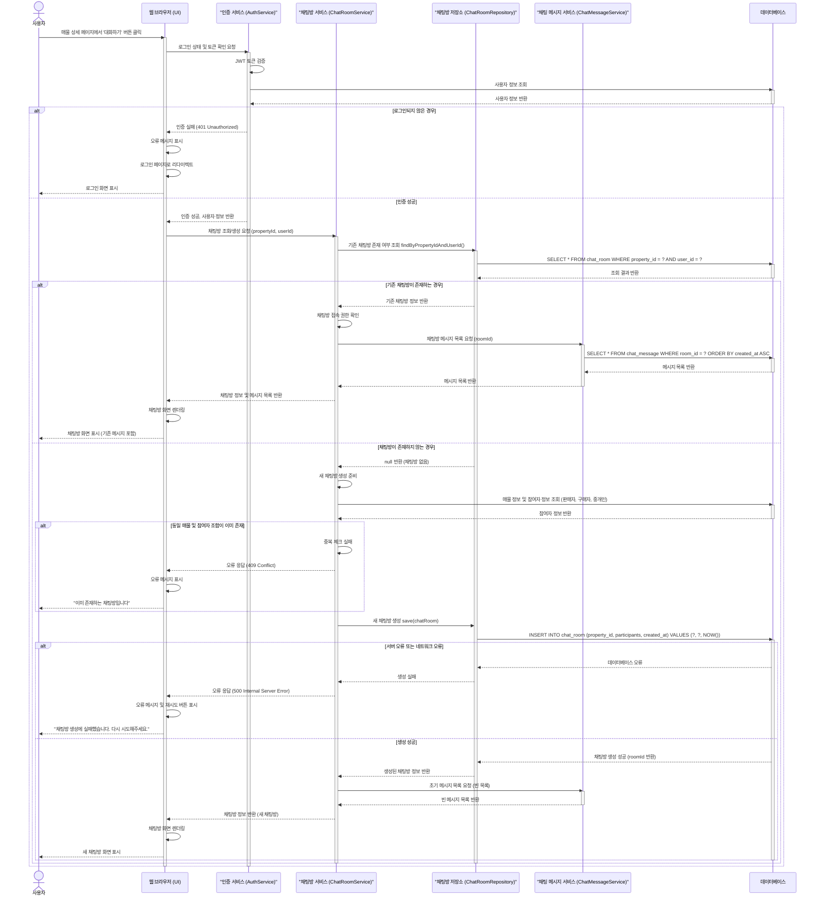
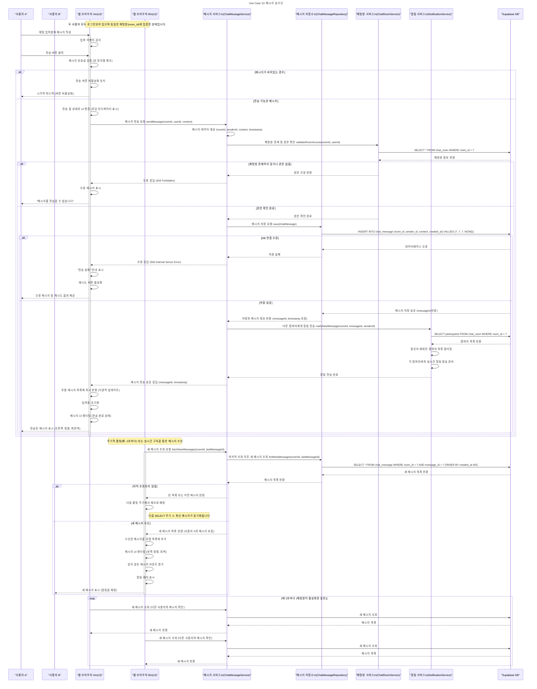
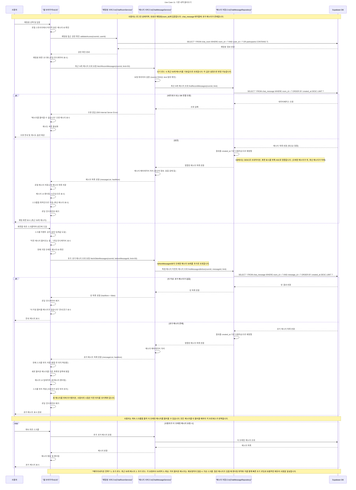
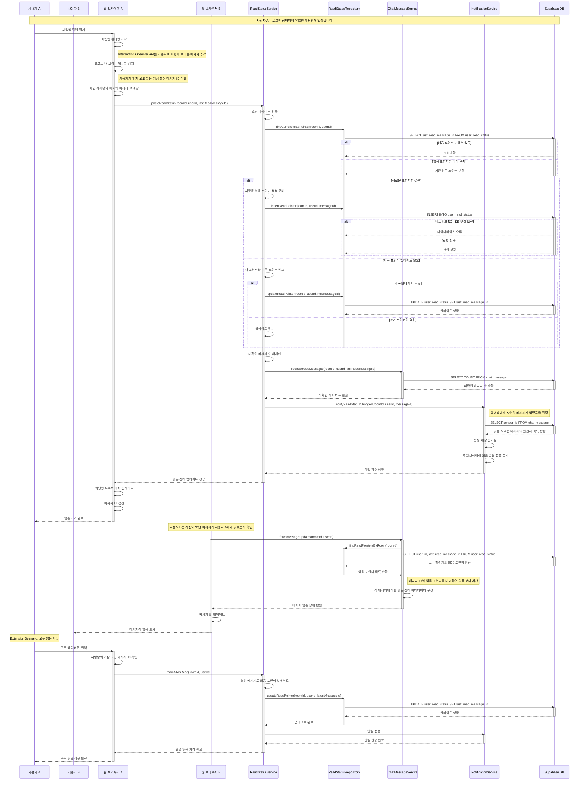
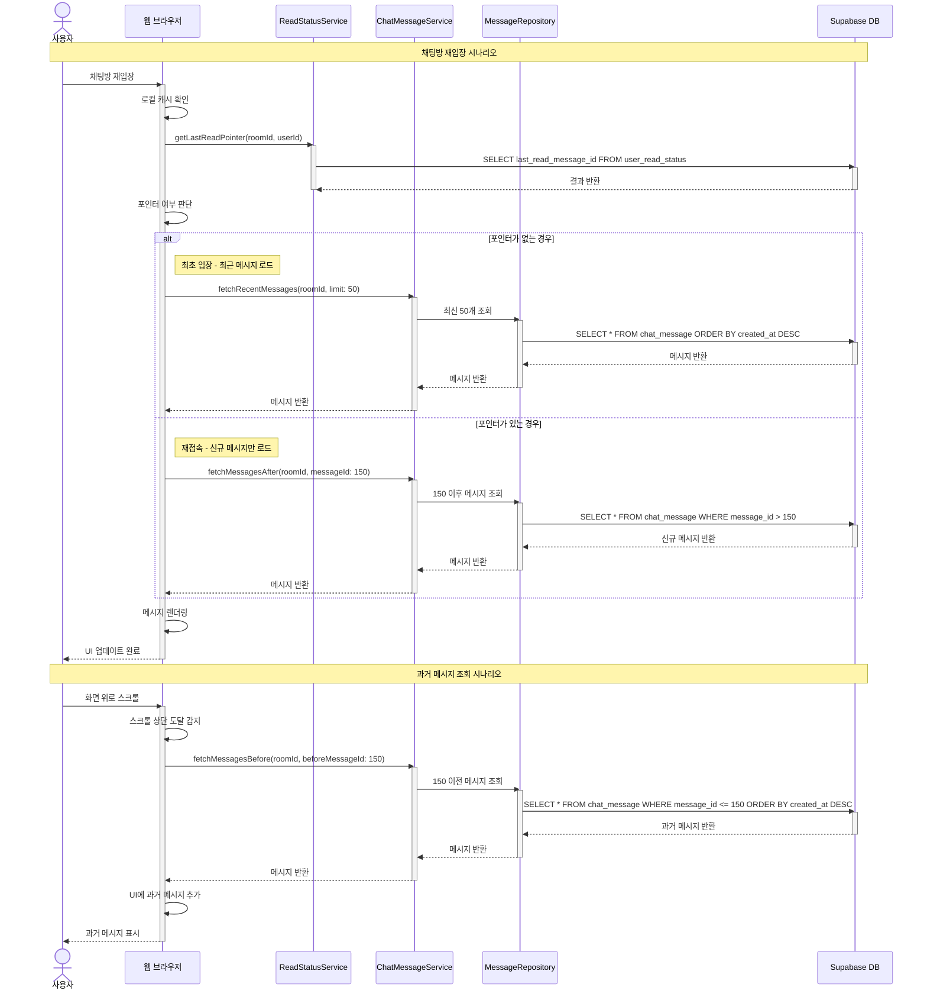
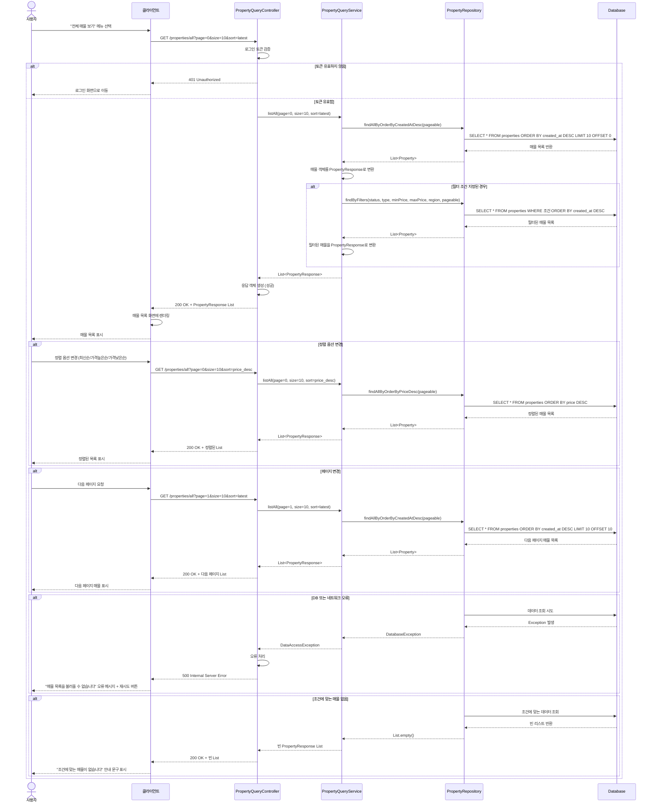

# 도림이의 use case 9번 기능 예시

```mermaid
sequenceDiagram
    actor User as 사용자
    participant Browser as 웹 브라우저 (UI)
    participant Auth as "인증 서비스 (AuthService)"
    participant ChatService as "채팅방 서비스 (ChatRoomService)"
    participant ChatRepo as "채팅방 저장소 (ChatRoomRepository)"
    participant MessageService as "채팅 메시지 서비스 (ChatMessageService)"
    participant DB as 데이터베이스

    %% Main Success Scenario %%

    User->>Browser: 매물 상세 페이지에서 '대화하기' 버튼 클릭
    activate Browser

    Browser->>Auth: 로그인 상태 및 토큰 확인 요청
    activate Auth

    Auth->>Auth: JWT 토큰 검증
    Auth->>DB: 사용자 정보 조회
    activate DB
    DB-->>Auth: 사용자 정보 반환
    deactivate DB

    alt 로그인되지 않은 경우
        Auth-->>Browser: 인증 실패 (401 Unauthorized)
        Browser->>Browser: 오류 메시지 표시
        Browser->>Browser: 로그인 페이지로 리다이렉트
        Browser-->>User: 로그인 화면 표시
    else 인증 성공
        Auth-->>Browser: 인증 성공, 사용자 정보 반환

        Browser->>ChatService: 채팅방 조회/생성 요청 (propertyId, userId)
        activate ChatService

        ChatService->>ChatRepo: 기존 채팅방 존재 여부 조회 findByPropertyIdAndUserId()
        activate ChatRepo

        ChatRepo->>DB: SELECT * FROM chat_room WHERE property_id = ? AND user_id = ?
        activate DB
        DB-->>ChatRepo: 조회 결과 반환
        deactivate DB

        alt 기존 채팅방이 존재하는 경우
            ChatRepo-->>ChatService: 기존 채팅방 정보 반환
            
            ChatService->>ChatService: 채팅방 접속 권한 확인
            
            ChatService->>MessageService: 채팅방 메시지 목록 요청 (roomId)
            activate MessageService
            
            MessageService->>DB: SELECT * FROM chat_message WHERE room_id = ? ORDER BY created_at ASC
            activate DB
            DB-->>MessageService: 메시지 목록 반환
            deactivate DB
            
            MessageService-->>ChatService: 메시지 목록 반환
            deactivate MessageService
            
            ChatService-->>Browser: 채팅방 정보 및 메시지 목록 반환
            
            Browser->>Browser: 채팅방 화면 렌더링
            Browser-->>User: 채팅방 화면 표시 (기존 메시지 포함)

        else 채팅방이 존재하지 않는 경우
            ChatRepo-->>ChatService: null 반환 (채팅방 없음)
            
            ChatService->>ChatService: 새 채팅방 생성 준비
            
            ChatService->>DB: 매물 정보 및 참여자 정보 조회 (판매자, 구매자, 중개인)
            activate DB
            DB-->>ChatService: 참여자 정보 반환
            deactivate DB
            
            alt 동일 매물 및 참여자 조합이 이미 존재
                ChatService->>ChatService: 중복 체크 실패
                ChatService-->>Browser: 오류 응답 (409 Conflict)
                Browser->>Browser: 오류 메시지 표시
                Browser-->>User: "이미 존재하는 채팅방입니다"
            end
            
            ChatService->>ChatRepo: 새 채팅방 생성 save(chatRoom)
            
            ChatRepo->>DB: INSERT INTO chat_room (property_id, participants, created_at) VALUES (?, ?, NOW())
            activate DB
            
            alt 서버 오류 또는 네트워크 오류
                DB-->>ChatRepo: 데이터베이스 오류
                ChatRepo-->>ChatService: 생성 실패
                ChatService-->>Browser: 오류 응답 (500 Internal Server Error)
                Browser->>Browser: 오류 메시지 및 재시도 버튼 표시
                Browser-->>User: "채팅방 생성에 실패했습니다. 다시 시도해주세요."
            else 생성 성공
                DB-->>ChatRepo: 채팅방 생성 성공 (roomId 반환)
                ChatRepo-->>ChatService: 생성된 채팅방 정보 반환
                
                ChatService->>MessageService: 초기 메시지 목록 요청 (빈 목록)
                activate MessageService
                MessageService-->>ChatService: 빈 메시지 목록 반환
                deactivate MessageService
                
                ChatService-->>Browser: 채팅방 정보 반환 (새 채팅방)
                
                Browser->>Browser: 채팅방 화면 렌더링
                Browser-->>User: 새 채팅방 화면 표시
            end
            deactivate DB
        end
        deactivate ChatRepo
        deactivate ChatService
    end
    deactivate Auth
    deactivate Browser
```

# 도림 10번

```mermaid
sequenceDiagram
title Use Case 10: 메시지 송수신

participant UserA as "사용자 A"
participant UserB as "사용자 B"
participant BrowserA as "웹 브라우저 A\n(UI)"
participant BrowserB as "웹 브라우저 B\n(UI)"
participant MessageService as "메시지 서비스\n(ChatMessageService)"
participant MessageRepo as "메시지 저장소\n(ChatMessageRepository)"
participant ChatRoomService as "채팅방 서비스\n(ChatRoomService)"
participant NotificationService as "알림 서비스\n(NotificationService)"
participant DB as "Supabase DB"

note over BrowserA, BrowserB: 두 사용자 모두 로그인되어 있으며 동일한 채팅방(room_id)에 입장한 상태입니다.

UserA ->> BrowserA: 채팅 입력창에 메시지 작성
activate BrowserA

BrowserA ->> BrowserA: 입력 이벤트 감지

UserA ->> BrowserA: 전송 버튼 클릭
BrowserA ->> BrowserA: 메시지 유효성 검증 (빈 문자열 체크)

alt 메시지가 비어있는 경우
    BrowserA ->> BrowserA: 전송 버튼 비활성화 유지
    BrowserA -->> UserA: 시각적 피드백 (버튼 비활성화)
else 전송 가능한 메시지
    BrowserA ->> BrowserA: 전송 중 상태로 UI 변경 (로딩 인디케이터 표시)

    BrowserA ->> MessageService: 메시지 전송 요청 sendMessage(roomId, userId, content)

    MessageService ->> MessageService: 메시지 데이터 생성 (roomId, senderId, content, timestamp)

    MessageService ->> ChatRoomService: 채팅방 존재 및 권한 확인 validateRoomAccess(roomId, userId)

    ChatRoomService ->> DB: SELECT * FROM chat_room WHERE room_id = ?
    DB -->> ChatRoomService: 채팅방 정보 반환

    alt 채팅방 존재하지 않거나 권한 없음
        ChatRoomService -->> MessageService: 권한 오류 반환
        MessageService -->> BrowserA: 오류 응답 (403 Forbidden)
        BrowserA ->> BrowserA: 오류 메시지 표시
        BrowserA -->> UserA: "메시지를 전송할 수 없습니다"
    else 권한 확인 완료
        ChatRoomService -->> MessageService: 권한 확인 완료

        MessageService ->> MessageRepo: 메시지 저장 요청 save(chatMessage)

        MessageRepo ->> DB: INSERT INTO chat_message (room_id, sender_id, content, created_at) VALUES (?, ?, ?, NOW())

        alt DB 연결 오류
            DB -->> MessageRepo: 데이터베이스 오류
            MessageRepo -->> MessageService: 저장 실패
            MessageService -->> BrowserA: 오류 응답 (500 Internal Server Error)
            BrowserA ->> BrowserA: "전송 실패" 안내 표시
            BrowserA ->> BrowserA: 재시도 버튼 활성화
            BrowserA -->> UserA: 오류 메시지 및 재시도 옵션 제공
        else 저장 성공
            DB -->> MessageRepo: 메시지 저장 성공 (messageId 반환)
            MessageRepo -->> MessageService: 저장된 메시지 정보 반환 (messageId, timestamp 포함)

            MessageService ->> NotificationService: 다른 참여자에게 알림 전송 notifyNewMessage(roomId, messageId, senderId)

            NotificationService ->> DB: SELECT participants FROM chat_room WHERE room_id = ?
            DB -->> NotificationService: 참여자 목록 반환

            NotificationService ->> NotificationService: 발신자 제외한 참여자 목록 필터링
            NotificationService ->> NotificationService: 각 참여자에게 실시간 알림 발송 준비
            NotificationService -->> MessageService: 알림 전송 완료

            MessageService -->> BrowserA: 메시지 전송 성공 응답 (messageId, timestamp)

            BrowserA ->> BrowserA: 로컬 메시지 목록에 즉시 반영 (낙관적 업데이트)
            BrowserA ->> BrowserA: 입력창 초기화
            BrowserA ->> BrowserA: 메시지 UI 렌더링 (전송 완료 상태)
            BrowserA -->> UserA: 전송된 메시지 표시 (오른쪽 정렬, 파란색)
        end
    end
end
deactivate BrowserA

note over BrowserB: 주기적 폴링(예: 2초마다) 또는 실시간 구독을 통한 메시지 수신

BrowserB ->> MessageService: 새 메시지 조회 요청 fetchNewMessages(roomId, lastMessageId)
activate BrowserB

MessageService ->> MessageRepo: 마지막 조회 이후 새 메시지 조회 findNewMessages(roomId, lastMessageId)

MessageRepo ->> DB: SELECT * FROM chat_message WHERE room_id = ? AND message_id > ? ORDER BY created_at ASC
DB -->> MessageRepo: 새 메시지 목록 반환

MessageRepo -->> MessageService: 메시지 목록 반환

alt 아직 조회되지 않음
    MessageService -->> BrowserB: 빈 목록 또는 이전 메시지 반환
    BrowserB ->> BrowserB: 다음 폴링 주기에서 재조회 예정
    note right of BrowserB: 다음 SELECT 주기 시 최신 메시지가 동기화됩니다
else 새 메시지 수신
    MessageService -->> BrowserB: 새 메시지 목록 반환 (사용자 A의 메시지 포함)

    BrowserB ->> BrowserB: 수신된 메시지를 로컬 목록에 추가
    BrowserB ->> BrowserB: 메시지 UI 렌더링 (왼쪽 정렬, 회색)
    BrowserB ->> BrowserB: 읽지 않은 메시지 카운트 증가
    BrowserB ->> BrowserB: 알림 배지 표시
    BrowserB -->> UserB: 새 메시지 표시 (알림음 재생)
end
deactivate BrowserB

loop 매 2초마다 (채팅방이 활성화된 동안)
    BrowserA ->> MessageService: 새 메시지 조회 (다른 사용자의 메시지 확인)
    MessageService ->> DB: 새 메시지 조회
    DB -->> MessageService: 메시지 목록
    MessageService -->> BrowserA: 새 메시지 반환

    BrowserB ->> MessageService: 새 메시지 조회 (다른 사용자의 메시지 확인)
    MessageService ->> DB: 새 메시지 조회
    DB -->> MessageService: 메시지 목록
    MessageService -->> BrowserB: 새 메시지 반환
end

```

# 도림 11번

```mermaid
sequenceDiagram
title Use Case 11: 기존 내역 불러오기

participant User as 사용자
participant Browser as "웹 브라우저\n(UI)"
participant ChatRoomService as "채팅방 서비스\n(ChatRoomService)"
participant MessageService as "메시지 서비스\n(ChatMessageService)"
participant MessageRepo as "메시지 저장소\n(ChatMessageRepository)"
participant DB as Supabase DB

note over User, DB: 사용자는 로그인 상태이며, 유효한 채팅방(room_id)에 입장합니다. chat_message 테이블에 과거 메시지가 존재합니다.

User ->> Browser: 채팅방 선택 및 입장

Browser ->> Browser: 로컬 스토리지에서 마지막 읽은 메시지 ID 확인

Browser ->> ChatRoomService: 채팅방 접근 권한 확인 validateAccess(roomId, userId)

ChatRoomService ->> DB: SELECT * FROM chat_room WHERE room_id = ? AND (user_id = ? OR participants CONTAINS ?)
DB -->> ChatRoomService: 채팅방 정보 반환

ChatRoomService -->> Browser: 권한 확인 완료

Browser ->> Browser: 채팅방 화면 초기화 (로딩 인디케이터 표시)

Browser ->> MessageService: 최근 N개 메시지 조회 요청 fetchRecentMessages(roomId, limit=50)

note right of MessageService: 초기 로드 시 최근 50개 메시지를 기본값으로 조회합니다. 이 값은 설정으로 변경 가능합니다.

MessageService ->> MessageService: 요청 파라미터 검증 (roomId 유효성, limit 범위 확인)

MessageService ->> MessageRepo: 최신 N개 메시지 조회 findRecentMessages(roomId, limit)

MessageRepo ->> DB: SELECT * FROM chat_message WHERE room_id = ? ORDER BY created_at DESC LIMIT ?

alt 네트워크 또는 DB 연결 오류
    DB -->> MessageRepo: 데이터베이스 오류
    MessageRepo -->> MessageService: 조회 실패
    MessageService -->> Browser: 오류 응답 (500 Internal Server Error)
    Browser ->> Browser: "메시지를 불러올 수 없습니다" 오류 메시지 표시
    Browser ->> Browser: 재시도 버튼 활성화
    Browser -->> User: 오류 안내 및 재시도 옵션 제공
else 성공
    DB -->> MessageRepo: 메시지 목록 반환 (최신순 정렬)
    MessageRepo ->> MessageRepo: 결과를 created_at 기준 오름차순으로 재정렬
    note right of MessageRepo: DB에서는 DESC로 조회하지만, 화면 표시를 위해 ASC로 정렬합니다. (오래된 메시지가 위, 최신 메시지가 아래)
    MessageRepo -->> MessageService: 정렬된 메시지 목록 반환
    MessageService ->> MessageService: 메시지 메타데이터 처리 (발신자 정보, 읽음 상태 등)
    MessageService -->> Browser: 메시지 목록 반환 (messageList, hasMore)
    Browser ->> Browser: 로컬 메시지 저장소에 메시지 목록 저장
    Browser ->> Browser: 메시지 UI 렌더링 (시간순으로 표시)
    Browser ->> Browser: 스크롤을 최하단으로 이동 (최신 메시지 표시)
    Browser ->> Browser: 로딩 인디케이터 제거
    Browser -->> User: 채팅 화면 표시 (최근 50개 메시지)
end

User ->> Browser: 화면을 위로 스크롤하여 상단에 도달

Browser ->> Browser: 스크롤 이벤트 감지 (상단 임계값 도달)

Browser ->> Browser: "이전 메시지 불러오는 중..." 로딩 인디케이터 표시

Browser ->> Browser: 현재 가장 오래된 메시지 ID 확인

Browser ->> MessageService: 추가 과거 메시지 조회 요청 fetchOlderMessages(roomId, beforeMessageId, limit=50)

note right of MessageService: beforeMessageId보다 오래된 메시지 50개를 추가로 조회합니다.

MessageService ->> MessageRepo: 특정 메시지 이전의 메시지 조회 findMessagesBefore(roomId, messageId, limit)

MessageRepo ->> DB: SELECT * FROM chat_message WHERE room_id = ? AND message_id < ? ORDER BY created_at DESC LIMIT ?

alt 더 이상 과거 메시지가 없음
    DB -->> MessageRepo: 빈 결과 반환
    MessageRepo -->> MessageService: 빈 목록 반환
    MessageService -->> Browser: 빈 목록 반환 (hasMore = false)
    Browser ->> Browser: 로딩 인디케이터 제거
    Browser ->> Browser: "더 이상 불러올 메시지가 없습니다" 안내 문구 표시
    Browser -->> User: 안내 메시지 표시
else 과거 메시지 존재
    DB -->> MessageRepo: 과거 메시지 목록 반환
    MessageRepo ->> MessageRepo: 결과를 created_at 기준 오름차순으로 재정렬
    MessageRepo -->> MessageService: 정렬된 메시지 목록 반환
    MessageService ->> MessageService: 메시지 메타데이터 처리
    MessageService -->> Browser: 과거 메시지 목록 반환 (messageList, hasMore)
    Browser ->> Browser: 현재 스크롤 위치 저장 (병합 후 위치 복원용)
    Browser ->> Browser: 새로 불러온 메시지를 기존 목록의 앞쪽에 병합
    Browser ->> Browser: 메시지 UI 업데이트 (새 메시지 렌더링)
    Browser ->> Browser: 스크롤 위치 복원 (사용자가 보던 위치 유지)
    note right of Browser: 새 메시지를 위에 추가했지만, 사용자의 시점은 이전 위치를 유지해야 합니다.
    Browser ->> Browser: 로딩 인디케이터 제거
    Browser -->> User: 과거 메시지 표시 완료
end

note over User, DB: 사용자는 계속 스크롤을 올려 더 오래된 메시지를 불러올 수 있습니다. 모든 메시지를 다 불러올 때까지 이 프로세스가 반복됩니다.

loop 사용자가 더 오래된 메시지 요청 시
    User ->> Browser: 계속 위로 스크롤
    Browser ->> MessageService: 추가 과거 메시지 요청
    MessageService ->> DB: 더 오래된 메시지 조회
    DB -->> MessageService: 메시지 목록
    MessageService -->> Browser: 메시지 반환
    Browser ->> Browser: 메시지 병합 및 렌더링
    Browser -->> User: 과거 메시지 표시
end

note over Browser, DB: **페이지네이션 전략** 1. 초기 로드: 최근 50개 메시지 2. 추가 로드: 각 요청마다 50개씩 3. 캐싱: 이미 불러온 메시지는 재요청하지 않음 4. 가상 스크롤: 많은 메시지가 있을 때 렌더링 최적화 이를 통해 빠른 초기 로딩과 효율적인 메모리 사용을 달성합니다.

```

# 도림 12

```mermaid
sequenceDiagram
    participant UserA as 사용자 A
    participant UserB as 사용자 B
    participant BrowserA as 웹 브라우저 A
    participant BrowserB as 웹 브라우저 B
    participant ReadService as ReadStatusService
    participant ReadRepo as ReadStatusRepository
    participant MessageService as ChatMessageService
    participant NotificationService as NotificationService
    participant DB as Supabase DB

    note over UserA, DB: 사용자 A는 로그인 상태이며 유효한 채팅방에 입장합니다

    UserA->>BrowserA: 채팅방 화면 열기
    activate BrowserA
    BrowserA->>BrowserA: 채팅방 렌더링 시작

    note right of BrowserA: Intersection Observer API를 사용하여 화면에 보이는 메시지 추적
    BrowserA->>BrowserA: 뷰포트 내 보이는 메시지 감지

    note right of BrowserA: 사용자가 현재 보고 있는 가장 최신 메시지 ID 식별
    BrowserA->>BrowserA: 화면 최하단의 마지막 메시지 ID 계산

    BrowserA->>ReadService: updateReadStatus(roomId, userId, lastReadMessageId)
    activate ReadService
    ReadService->>ReadService: 요청 파라미터 검증

    ReadService->>ReadRepo: findCurrentReadPointer(roomId, userId)
    activate ReadRepo
    ReadRepo->>DB: SELECT last_read_message_id FROM user_read_status
    activate DB
    alt 읽음 포인터 기록이 없음
        DB-->>ReadRepo: null 반환
    else 읽음 포인터가 이미 존재
        DB-->>ReadRepo: 기존 읽음 포인터 반환
    end
    deactivate DB

    alt 새로운 포인터인 경우
        ReadService->>ReadService: 새로운 읽음 포인터 생성 준비
        ReadService->>ReadRepo: insertReadPointer(roomId, userId, messageId)
        ReadRepo->>DB: INSERT INTO user_read_status
        activate DB
        alt 네트워크 또는 DB 연결 오류
            DB-->>ReadRepo: 데이터베이스 오류
        else 삽입 성공
            DB-->>ReadRepo: 삽입 성공
        end
        deactivate DB
    else 기존 포인터 업데이트 필요
        ReadService->>ReadService: 새 포인터와 기존 포인터 비교
        alt 새 포인터가 더 최신
            ReadService->>ReadRepo: updateReadPointer(roomId, userId, newMessageId)
            ReadRepo->>DB: UPDATE user_read_status SET last_read_message_id
            activate DB
            DB-->>ReadRepo: 업데이트 성공
            deactivate DB
        else 과거 포인터인 경우
            ReadService->>ReadService: 업데이트 무시
        end
    end
    deactivate ReadRepo

    ReadService->>ReadService: 미확인 메시지 수 재계산

    ReadService->>MessageService: countUnreadMessages(roomId, userId, lastReadMessageId)
    activate MessageService
    MessageService->>DB: SELECT COUNT FROM chat_message
    activate DB
    DB-->>MessageService: 미확인 메시지 수 반환
    deactivate DB
    MessageService-->>ReadService: 미확인 메시지 수 반환
    deactivate MessageService

    ReadService->>NotificationService: notifyReadStatusChanged(roomId, userId, messageId)
    activate NotificationService

    note right of NotificationService: 상대방에게 자신의 메시지가 읽혔음을 알림

    NotificationService->>DB: SELECT sender_id FROM chat_message
    activate DB
    DB-->>NotificationService: 읽음 처리된 메시지의 발신자 목록 반환
    deactivate DB

    NotificationService->>NotificationService: 알림 대상 필터링
    NotificationService->>NotificationService: 각 발신자에게 읽음 알림 전송 준비

    NotificationService-->>ReadService: 알림 전송 완료
    deactivate NotificationService

    ReadService-->>BrowserA: 읽음 상태 업데이트 성공
    deactivate ReadService

    BrowserA->>BrowserA: 채팅방 목록의 배지 업데이트
    BrowserA->>BrowserA: 메시지 UI 갱신
    BrowserA-->>UserA: 읽음 처리 완료
    deactivate BrowserA

    note over BrowserB: 사용자 B는 자신이 보낸 메시지가 사용자 A에게 읽혔는지 확인

    BrowserB->>MessageService: fetchMessageUpdates(roomId, userId)
    activate BrowserB
    activate MessageService

    MessageService->>ReadRepo: findReadPointersByRoom(roomId)
    activate ReadRepo
    ReadRepo->>DB: SELECT user_id, last_read_message_id FROM user_read_status
    activate DB
    DB-->>ReadRepo: 모든 참여자의 읽음 포인터 반환
    deactivate DB
    ReadRepo-->>MessageService: 읽음 포인터 목록 반환
    deactivate ReadRepo

    note right of MessageService: 메시지 ID와 읽음 포인터를 비교하여 읽음 상태 계산
    MessageService->>MessageService: 각 메시지에 대한 읽음 상태 메타데이터 구성

    MessageService-->>BrowserB: 메시지 읽음 상태 반환
    deactivate MessageService

    BrowserB->>BrowserB: 메시지 UI 업데이트
    BrowserB-->>UserB: 메시지에 읽음 표시
    deactivate BrowserB

    note over UserA: Extension Scenario: 모두 읽음 기능

    UserA->>BrowserA: 모두 읽음 버튼 클릭
    activate BrowserA
    BrowserA->>BrowserA: 채팅방의 가장 최신 메시지 ID 확인

    BrowserA->>ReadService: markAllAsRead(roomId, userId)
    activate ReadService
    ReadService->>ReadService: 최신 메시지로 읽음 포인터 업데이트

    ReadService->>ReadRepo: updateReadPointer(roomId, userId, latestMessageId)
    activate ReadRepo
    ReadRepo->>DB: UPDATE user_read_status SET last_read_message_id
    activate DB
    DB-->>ReadRepo: 업데이트 성공
    deactivate DB
    ReadRepo-->>ReadService: 업데이트 완료
    deactivate ReadRepo

    ReadService->>NotificationService: 알림 전송
    activate NotificationService
    NotificationService-->>ReadService: 알림 전송 완료
    deactivate NotificationService

    ReadService-->>BrowserA: 일괄 읽음 처리 완료
    deactivate ReadService

    BrowserA-->>UserA: 모두 읽음 적용 완료
    deactivate BrowserA
```

# 도림 13

```mermaid
sequenceDiagram
    actor User as 사용자
    participant Browser as 웹 브라우저
    participant ReadService as ReadStatusService
    participant MessageService as ChatMessageService
    participant MessageRepo as MessageRepository
    participant DB as Supabase DB

    note over User,DB: 채팅방 재입장 시나리오

    User->>Browser: 채팅방 재입장
    activate Browser
    
    Browser->>Browser: 로컬 캐시 확인
    
    Browser->>ReadService: getLastReadPointer(roomId, userId)
    activate ReadService
    
    ReadService->>DB: SELECT last_read_message_id FROM user_read_status
    activate DB
    DB-->>ReadService: 결과 반환
    deactivate DB
    deactivate ReadService
    
    Browser->>Browser: 포인터 여부 판단

    alt 포인터가 없는 경우
        note right of Browser: 최초 입장 - 최근 메시지 로드
        Browser->>MessageService: fetchRecentMessages(roomId, limit: 50)
        activate MessageService
        
        MessageService->>MessageRepo: 최신 50개 조회
        activate MessageRepo
        
        MessageRepo->>DB: SELECT * FROM chat_message ORDER BY created_at DESC
        activate DB
        DB-->>MessageRepo: 메시지 반환
        deactivate DB
        
        MessageRepo-->>MessageService: 메시지 반환
        deactivate MessageRepo
        
        MessageService-->>Browser: 메시지 반환
        deactivate MessageService
    else 포인터가 있는 경우
        note right of Browser: 재접속 - 신규 메시지만 로드
        Browser->>MessageService: fetchMessagesAfter(roomId, messageId: 150)
        activate MessageService
        
        MessageService->>MessageRepo: 150 이후 메시지 조회
        activate MessageRepo
        
        MessageRepo->>DB: SELECT * FROM chat_message WHERE message_id > 150
        activate DB
        DB-->>MessageRepo: 신규 메시지 반환
        deactivate DB
        
        MessageRepo-->>MessageService: 메시지 반환
        deactivate MessageRepo
        
        MessageService-->>Browser: 메시지 반환
        deactivate MessageService
    end

    Browser->>Browser: 메시지 렌더링
    Browser-->>User: UI 업데이트 완료
    deactivate Browser

    note over User,DB: 과거 메시지 조회 시나리오

    User->>Browser: 화면 위로 스크롤
    activate Browser
    
    Browser->>Browser: 스크롤 상단 도달 감지
    
    Browser->>MessageService: fetchMessagesBefore(roomId, beforeMessageId: 150)
    activate MessageService
    
    MessageService->>MessageRepo: 150 이전 메시지 조회
    activate MessageRepo
    
    MessageRepo->>DB: SELECT * FROM chat_message WHERE message_id <= 150 ORDER BY created_at DESC
    activate DB
    DB-->>MessageRepo: 과거 메시지 반환
    deactivate DB
    
    MessageRepo-->>MessageService: 메시지 반환
    deactivate MessageRepo
    
    MessageService-->>Browser: 메시지 반환
    deactivate MessageService
    
    Browser->>Browser: UI에 과거 메시지 추가
    Browser-->>User: 과거 메시지 표시
    deactivate Browser
```

# 도림 20번

```mermaid
sequenceDiagram
    actor User as 사용자
    participant UI as 클라이언트
    participant Controller as PropertyQueryController
    participant Service as PropertyQueryService
    participant Repository as PropertyRepository
    participant DB as Database

    User->>UI: "전체 매물 보기" 메뉴 선택
    UI->>Controller: GET /properties/all?page=0&size=10&sort=latest
    
    Controller->>Controller: 로그인 토큰 검증
    alt 토큰 유효하지 않음
        Controller-->>UI: 401 Unauthorized
        UI-->>User: 로그인 화면으로 이동
    else 토큰 유효함
        Controller->>Service: listAll(page=0, size=10, sort=latest)
        
        Service->>Repository: findAllByOrderByCreatedAtDesc(pageable)
        Repository->>DB: SELECT * FROM properties ORDER BY created_at DESC LIMIT 10 OFFSET 0
        DB-->>Repository: 매물 목록 반환
        
        Repository-->>Service: List<Property>
        
        Service->>Service: 매물 객체를 PropertyResponse로 변환
        
        alt 필터 조건 지정된 경우
            Service->>Repository: findByFilters(status, type, minPrice, maxPrice, region, pageable)
            Repository->>DB: SELECT * FROM properties WHERE 조건 ORDER BY created_at DESC
            DB-->>Repository: 필터된 매물 목록
            Repository-->>Service: List<Property>
            Service->>Service: 필터된 매물을 PropertyResponse로 변환
        end
        
        Service-->>Controller: List<PropertyResponse>
        
        Controller->>Controller: 응답 객체 생성 (성공)
        Controller-->>UI: 200 OK + PropertyResponse List
        
        UI->>UI: 매물 목록 화면에 렌더링
        UI-->>User: 매물 목록 표시
        
        alt 정렬 옵션 변경
            User->>UI: 정렬 옵션 변경 (최신순/가격높은순/가격낮은순)
            UI->>Controller: GET /properties/all?page=0&size=10&sort=price_desc
            Controller->>Service: listAll(page=0, size=10, sort=price_desc)
            Service->>Repository: findAllByOrderByPriceDesc(pageable)
            Repository->>DB: SELECT * FROM properties ORDER BY price DESC
            DB-->>Repository: 정렬된 매물 목록
            Repository-->>Service: List<Property>
            Service-->>Controller: List<PropertyResponse>
            Controller-->>UI: 200 OK + 정렬된 List
            UI-->>User: 정렬된 목록 표시
        end
        
        alt 페이지 변경
            User->>UI: 다음 페이지 요청
            UI->>Controller: GET /properties/all?page=1&size=10&sort=latest
            Controller->>Service: listAll(page=1, size=10, sort=latest)
            Service->>Repository: findAllByOrderByCreatedAtDesc(pageable)
            Repository->>DB: SELECT * FROM properties ORDER BY created_at DESC LIMIT 10 OFFSET 10
            DB-->>Repository: 다음 페이지 매물 목록
            Repository-->>Service: List<Property>
            Service-->>Controller: List<PropertyResponse>
            Controller-->>UI: 200 OK + 다음 페이지 List
            UI-->>User: 다음 페이지 매물 표시
        end
        
        alt DB 또는 네트워크 오류
            Repository->>DB: 데이터 조회 시도
            DB-->>Repository: Exception 발생
            Repository-->>Service: DatabaseException
            Service-->>Controller: DataAccessException
            Controller->>Controller: 오류 처리
            Controller-->>UI: 500 Internal Server Error
            UI-->>User: "매물 목록을 불러올 수 없습니다" 오류 메시지 + 재시도 버튼
        end
        
        alt 조건에 맞는 매물 없음
            Repository->>DB: 조건에 맞는 데이터 조회
            DB-->>Repository: 빈 리스트 반환
            Repository-->>Service: List.empty()
            Service-->>Controller: 빈 PropertyResponse List
            Controller-->>UI: 200 OK + 빈 List
            UI-->>User: "조건에 맞는 매물이 없습니다" 안내 문구 표시
        end
    end

```

# 도림 20번

```mermaid
sequenceDiagram
    actor User as 사용자 (소유자/중개인)
    participant UI as 클라이언트
    participant Controller as PropertyQueryController
    participant Service as PropertyQueryService
    participant Repository as PropertyRepository
    participant DB as Database

    User->>UI: "내 매물" 메뉴 선택
    UI->>Controller: GET /properties/mine?page=0&size=10&sort=latest
    
    Controller->>Controller: 로그인 토큰 검증
    alt 토큰 유효하지 않음
        Controller-->>UI: 401 Unauthorized
        UI-->>User: 로그인 화면으로 이동
    else 토큰 유효함
        Controller->>Service: listMine(userId, page=0, size=10, sort=latest)
        
        Service->>Repository: findByOwnerId(userId, pageable)
        Repository->>DB: SELECT * FROM properties WHERE owner_id = ? ORDER BY created_at DESC LIMIT 10 OFFSET 0
        DB-->>Repository: 사용자의 매물 목록 반환
        
        Repository-->>Service: List<Property>
        
        Service->>Service: 매물 객체를 PropertyResponse로 변환
        Service-->>Controller: List<PropertyResponse>
        
        Controller->>Controller: 응답 객체 생성 (성공)
        Controller-->>UI: 200 OK + PropertyResponse List
        
        UI->>UI: 내 매물 목록 화면에 렌더링
        UI-->>User: 내 매물 목록 표시
        
        alt 필터 조건 지정된 경우 (상태, 유형, 가격, 지역)
            User->>UI: 필터 조건 설정 (예: 거래 중, 주택 유형, 가격범위)
            UI->>Controller: GET /properties/mine?page=0&size=10&sort=latest&status=PENDING&type=APARTMENT
            Controller->>Service: listMine(userId, filters, pageable)
            Service->>Repository: findByOwnerIdAndFilters(userId, status, type, minPrice, maxPrice, region, pageable)
            Repository->>DB: SELECT * FROM properties WHERE owner_id = ? AND status = ? AND type = ? ... ORDER BY created_at DESC
            DB-->>Repository: 필터된 매물 목록
            Repository-->>Service: List<Property>
            Service->>Service: 필터된 매물을 PropertyResponse로 변환
            Service-->>Controller: List<PropertyResponse>
            Controller-->>UI: 200 OK + 필터된 List
            UI-->>User: 필터링된 목록 표시
        end
        
        alt 매물 상태 변경 요청
            User->>UI: 특정 매물의 상태 변경 (AVAILABLE → PENDING 또는 SOLD 등)
            UI->>Controller: PATCH /properties/{propertyId}/status
            
            Controller->>Controller: propertyId와 로그인 userId 확인
            alt 권한 불일치 (다른 사용자의 매물)
                Controller-->>UI: 403 Forbidden
                UI-->>User: "수정 권한이 없습니다" 오류 메시지
            else 권한 일치
                Controller->>Service: updatePropertyStatus(propertyId, userId, newStatus)
                
                Service->>Repository: findById(propertyId)
                Repository->>DB: SELECT * FROM properties WHERE id = ?
                DB-->>Repository: 매물 정보
                Repository-->>Service: Property
                
                Service->>Service: 권한 검증 (owner_id = userId)
                
                alt 권한 확인 완료
                    Service->>Repository: save(updatedProperty)
                    Repository->>DB: UPDATE properties SET status = ?, updated_at = ? WHERE id = ?
                    DB-->>Repository: 업데이트 완료
                    
                    Repository-->>Service: 업데이트된 Property
                    Service-->>Controller: PropertyResponse (상태 변경됨)
                    Controller-->>UI: 200 OK + 업데이트된 PropertyResponse
                    UI-->>User: "저장되었습니다" 안내 메시지 + 목록 갱신
                else 권한 검증 실패
                    Service-->>Controller: ForbiddenException
                    Controller-->>UI: 403 Forbidden
                    UI-->>User: "수정 권한이 없습니다" 오류 메시지
                end
            end
        end
        
        alt 매물 정보 수정 요청
            User->>UI: 특정 매물의 상세 정보 수정
            UI->>Controller: PATCH /properties/{propertyId}
            
            Controller->>Service: updateProperty(propertyId, userId, updateRequest)
            
            Service->>Repository: findById(propertyId)
            Repository->>DB: SELECT * FROM properties WHERE id = ?
            DB-->>Repository: 매물 정보
            Repository-->>Service: Property
            
            Service->>Service: 권한 검증
            alt 권한 일치
                Service->>Repository: save(updatedProperty)
                Repository->>DB: UPDATE properties SET title = ?, address = ?, price = ?, ... WHERE id = ?
                DB-->>Repository: 업데이트 완료
                Repository-->>Service: 업데이트된 Property
                Service-->>Controller: PropertyResponse
                Controller-->>UI: 200 OK + 업데이트된 PropertyResponse
                UI-->>User: "수정되었습니다" 안내 메시지
            else 권한 불일치
                Service-->>Controller: ForbiddenException
                Controller-->>UI: 403 Forbidden
                UI-->>User: "수정 권한이 없습니다" 오류 메시지
            end
        end
        
        alt 페이지 변경
            User->>UI: 다음 페이지 요청
            UI->>Controller: GET /properties/mine?page=1&size=10&sort=latest
            Controller->>Service: listMine(userId, page=1, size=10, sort=latest)
            Service->>Repository: findByOwnerId(userId, pageable)
            Repository->>DB: SELECT * FROM properties WHERE owner_id = ? ORDER BY created_at DESC LIMIT 10 OFFSET 10
            DB-->>Repository: 다음 페이지 매물 목록
            Repository-->>Service: List<Property>
            Service-->>Controller: List<PropertyResponse>
            Controller-->>UI: 200 OK + 다음 페이지 List
            UI-->>User: 다음 페이지 매물 표시
        end
        
        alt 정렬 옵션 변경
            User->>UI: 정렬 옵션 변경 (최신순/가격높은순/가격낮은순)
            UI->>Controller: GET /properties/mine?page=0&size=10&sort=price_desc
            Controller->>Service: listMine(userId, page=0, size=10, sort=price_desc)
            Service->>Repository: findByOwnerIdOrderByPrice(userId, pageable)
            Repository->>DB: SELECT * FROM properties WHERE owner_id = ? ORDER BY price DESC
            DB-->>Repository: 정렬된 매물 목록
            Repository-->>Service: List<Property>
            Service-->>Controller: List<PropertyResponse>
            Controller-->>UI: 200 OK + 정렬된 List
            UI-->>User: 정렬된 목록 표시
        end
        
        alt DB 또는 네트워크 오류
            Repository->>DB: 데이터 조회 시도
            DB-->>Repository: Exception 발생
            Repository-->>Service: DatabaseException
            Service-->>Controller: DataAccessException
            Controller->>Controller: 오류 처리
            Controller-->>UI: 500 Internal Server Error
            UI-->>User: "내 매물을 불러올 수 없습니다" 오류 메시지 + 재시도 버튼
        end
        
        alt 조건에 맞는 매물 없음
            Repository->>DB: 조건에 맞는 데이터 조회
            DB-->>Repository: 빈 리스트 반환
            Repository-->>Service: List.empty()
            Service-->>Controller: 빈 PropertyResponse List
            Controller-->>UI: 200 OK + 빈 List
            UI-->>User: "등록된 매물이 없습니다" 안내 문구 표시
        end
    end
```

# 도림 21번

```mermaid
sequenceDiagram
    actor User as 사용자
    participant UI as 클라이언트
    participant Controller as PropertyQueryController
    participant Service as PropertyQueryService
    participant Repository as PropertyRepository
    participant DB as Database

    User->>UI: "다른 소유자 매물 보기" 메뉴 선택
    UI->>Controller: GET /properties/others?page=0&size=10&sort=latest
    
    Controller->>Controller: 로그인 토큰 검증
    alt 토큰 유효하지 않음
        Controller-->>UI: 401 Unauthorized
        UI-->>User: 로그인 화면으로 이동
    else 토큰 유효함
        Controller->>Controller: 현재 userId 추출 (토큰에서)
        Controller->>Service: listOthers(userId, page=0, size=10, sort=latest)
        
        Service->>Repository: findByOwnerIdNotEqual(userId, pageable)
        Repository->>DB: SELECT * FROM properties WHERE owner_id != ? ORDER BY created_at DESC LIMIT 10 OFFSET 0
        DB-->>Repository: 다른 소유자의 매물 목록 반환
        
        Repository-->>Service: List<Property>
        
        Service->>Service: 매물 객체를 PropertyResponse로 변환
        Service-->>Controller: List<PropertyResponse>
        
        Controller->>Controller: 응답 객체 생성 (성공)
        Controller-->>UI: 200 OK + PropertyResponse List
        
        UI->>UI: 다른 소유자 매물 목록 화면에 렌더링
        UI-->>User: 다른 소유자 매물 목록 표시
        
        alt 필터 조건 지정된 경우 (상태, 유형, 가격, 지역)
            User->>UI: 필터 조건 설정 (예: AVAILABLE, APARTMENT, 가격범위, 지역)
            UI->>Controller: GET /properties/others?page=0&size=10&sort=latest&status=AVAILABLE&type=APARTMENT
            Controller->>Service: listOthers(userId, filters, pageable)
            Service->>Repository: findByOwnerIdNotEqualAndFilters(userId, status, type, minPrice, maxPrice, region, pageable)
            Repository->>DB: SELECT * FROM properties WHERE owner_id != ? AND status = ? AND type = ? ... ORDER BY created_at DESC
            DB-->>Repository: 필터된 다른 소유자 매물 목록
            Repository-->>Service: List<Property>
            Service->>Service: 필터된 매물을 PropertyResponse로 변환
            Service-->>Controller: List<PropertyResponse>
            Controller-->>UI: 200 OK + 필터된 List
            UI-->>User: 필터링된 목록 표시
        end
        
        alt 매물 상세 조회
            User->>UI: 특정 매물 클릭
            UI->>Controller: GET /properties/{propertyId}
            
            Controller->>Service: getPropertyDetail(propertyId)
            Service->>Repository: findById(propertyId)
            Repository->>DB: SELECT * FROM properties WHERE id = ?
            DB-->>Repository: 매물 정보
            Repository-->>Service: Property
            
            Service->>Repository: findImagesByPropertyId(propertyId)
            Repository->>DB: SELECT * FROM property_images WHERE property_id = ?
            DB-->>Repository: 이미지 목록
            
            Service->>Repository: findOffersByPropertyId(propertyId)
            Repository->>DB: SELECT * FROM property_offers WHERE property_id = ?
            DB-->>Repository: 거래 조건 목록
            
            Service->>Service: 매물, 이미지, 거래조건 통합
            Service-->>Controller: PropertyWithOffersDto
            
            Controller-->>UI: 200 OK + PropertyWithOffersDto
            UI-->>User: 매물 상세 정보 표시
        end
        
        alt 매물이 자신의 매물인 경우 (owner_id = userId)
            Service->>Service: 권한 확인 (다른 사용자의 매물임)
            Service-->>Controller: 정상 처리 (수정/상태 변경 불가)
            Controller-->>UI: 200 OK + 읽기 전용 응답
            UI-->>User: 상세 보기만 가능 (수정 버튼 미표시)
        end
        
        alt 매물 즐겨찾기 (찜)
            User->>UI: 매물 찜하기 버튼 클릭
            UI->>Controller: POST /properties/{propertyId}/favorites
            
            Controller->>Service: addFavorite(propertyId, userId)
            Service->>Repository: saveFavorite(propertyId, userId)
            Repository->>DB: INSERT INTO favorites (property_id, user_id, created_at) VALUES (?, ?, NOW())
            DB-->>Repository: 저장 완료
            Repository-->>Service: 성공
            
            Service-->>Controller: 성공 응답
            Controller-->>UI: 200 OK + 찜 확인
            UI-->>User: "찜되었습니다" 안내 메시지 + 하트 아이콘 활성화
        end
        
        alt 매물 채팅 시작
            User->>UI: 매물에 대해 "문의하기" 클릭
            UI->>Controller: POST /chat/rooms
            
            Controller->>Service: createOrGetChatRoom(propertyId, userId, ownerId)
            Service->>Repository: findChatRoom(propertyId, userId, ownerId)
            alt 기존 채팅방 존재
                Repository->>DB: SELECT * FROM chat_rooms WHERE ...
                DB-->>Repository: 기존 채팅방
                Repository-->>Service: ChatRoom
            else 새 채팅방 생성
                Service->>Repository: saveChatRoom(propertyId, userId, ownerId)
                Repository->>DB: INSERT INTO chat_rooms (property_id, user1_id, user2_id, created_at) VALUES (...)
                DB-->>Repository: 새 채팅방
                Repository-->>Service: ChatRoom
            end
            
            Service-->>Controller: ChatRoom
            Controller-->>UI: 200 OK + ChatRoomId
            UI-->>User: 채팅 화면으로 전환
        end
        
        alt 페이지 변경
            User->>UI: 다음 페이지 요청
            UI->>Controller: GET /properties/others?page=1&size=10&sort=latest
            Controller->>Service: listOthers(userId, page=1, size=10, sort=latest)
            Service->>Repository: findByOwnerIdNotEqual(userId, pageable)
            Repository->>DB: SELECT * FROM properties WHERE owner_id != ? ORDER BY created_at DESC LIMIT 10 OFFSET 10
            DB-->>Repository: 다음 페이지 매물 목록
            Repository-->>Service: List<Property>
            Service-->>Controller: List<PropertyResponse>
            Controller-->>UI: 200 OK + 다음 페이지 List
            UI-->>User: 다음 페이지 매물 표시
        end
        
        alt 정렬 옵션 변경
            User->>UI: 정렬 옵션 변경 (최신순/가격높은순/가격낮은순)
            UI->>Controller: GET /properties/others?page=0&size=10&sort=price_desc
            Controller->>Service: listOthers(userId, page=0, size=10, sort=price_desc)
            Service->>Repository: findByOwnerIdNotEqualOrderByPrice(userId, pageable)
            Repository->>DB: SELECT * FROM properties WHERE owner_id != ? ORDER BY price DESC
            DB-->>Repository: 정렬된 매물 목록
            Repository-->>Service: List<Property>
            Service-->>Controller: List<PropertyResponse>
            Controller-->>UI: 200 OK + 정렬된 List
            UI-->>User: 정렬된 목록 표시
        end
        
        alt DB 또는 네트워크 오류
            Repository->>DB: 데이터 조회 시도
            DB-->>Repository: Exception 발생
            Repository-->>Service: DatabaseException
            Service-->>Controller: DataAccessException
            Controller->>Controller: 오류 처리
            Controller-->>UI: 500 Internal Server Error
            UI-->>User: "다른 소유자 매물을 불러올 수 없습니다" 오류 메시지 + 재시도 버튼
        end
        
        alt 조건에 맞는 매물 없음
            Repository->>DB: 조건에 맞는 데이터 조회
            DB-->>Repository: 빈 리스트 반환
            Repository-->>Service: List.empty()
            Service-->>Controller: 빈 PropertyResponse List
            Controller-->>UI: 200 OK + 빈 List
            UI-->>User: "조건에 맞는 매물이 없습니다" 안내 문구 표시
        end
    end

```

# 도림 22번

```mermaid
sequenceDiagram
    actor User as 사용자
    participant UI as 클라이언트
    participant Controller as PropertyQueryController
    participant Service as PropertyQueryService
    participant Repository as PropertyRepository
    participant ImageRepository as PropertyImageRepository
    participant OfferRepository as PropertyOfferRepository
    participant ReviewRepository as PropertyReviewRepository
    participant DB as Database

    User->>UI: 매물 목록에서 특정 매물 선택
    UI->>Controller: GET /properties/{propertyId}
    
    Controller->>Controller: 로그인 토큰 검증
    alt 토큰 유효하지 않음
        Controller-->>UI: 401 Unauthorized
        UI-->>User: 로그인 화면으로 이동
    else 토큰 유효함
        Controller->>Service: getPropertyDetail(propertyId)
        
        Service->>Repository: findById(propertyId)
        Repository->>DB: SELECT * FROM properties WHERE id = ?
        DB-->>Repository: 매물 기본정보
        Repository-->>Service: Property Entity
        
        alt 매물 존재하지 않음
            Service-->>Controller: EntityNotFoundException
            Controller-->>UI: 404 Not Found
            UI-->>User: "존재하지 않는 매물입니다" 메시지
        else 매물 존재함
            Service->>ImageRepository: findByPropertyId(propertyId)
            ImageRepository->>DB: SELECT * FROM property_images WHERE property_id = ?
            DB-->>ImageRepository: 이미지 목록
            ImageRepository-->>Service: List<PropertyImage>
            
            Service->>OfferRepository: findByPropertyId(propertyId)
            OfferRepository->>DB: SELECT * FROM property_offers WHERE property_id = ? AND is_active = true
            DB-->>OfferRepository: 활성화된 거래조건 목록
            OfferRepository-->>Service: List<PropertyOffer>
            
            Service->>ReviewRepository: findByPropertyId(propertyId)
            ReviewRepository->>DB: SELECT * FROM property_reviews WHERE property_id = ? ORDER BY created_at DESC
            DB-->>ReviewRepository: 리뷰 목록
            ReviewRepository-->>Service: List<PropertyReview>
            
            Service->>Service: Property + Images + Offers + Reviews 통합
            Service-->>Controller: PropertyWithOffersDto
            
            Controller->>Controller: 응답 객체 생성 (성공)
            Controller-->>UI: 200 OK + PropertyWithOffersDto
            
            UI->>UI: 매물 상세 화면 렌더링
            UI->>UI: 기본정보, 이미지 갤러리, 거래조건, 리뷰 표시
            UI-->>User: 매물 상세 정보 표시
            
            alt 사용자가 이미지 클릭
                User->>UI: 이미지 클릭하여 확대 보기
                UI->>UI: 라이트박스/모달에서 이미지 표시
                UI-->>User: 확대된 이미지 표시
            end
            
            alt 사용자가 리뷰 더보기 클릭
                User->>UI: "리뷰 더보기" 버튼 클릭
                UI->>Controller: GET /properties/{propertyId}/reviews?page=0&size=5
                
                Controller->>Service: getPropertyReviews(propertyId, pageable)
                Service->>ReviewRepository: findByPropertyIdWithPagination(propertyId, pageable)
                ReviewRepository->>DB: SELECT * FROM property_reviews WHERE property_id = ? ORDER BY created_at DESC LIMIT 5 OFFSET 0
                DB-->>ReviewRepository: 리뷰 목록 (페이지네이션)
                ReviewRepository-->>Service: Page<PropertyReview>
                
                Service->>Service: 평균 평점 계산
                Service-->>Controller: List<PropertyReviewDto>
                Controller-->>UI: 200 OK + 리뷰 목록
                UI-->>User: 리뷰 목록 표시
            end
            
            alt 사용자가 즐겨찾기(찜) 버튼 클릭
                User->>UI: 하트 아이콘(즐겨찾기) 클릭
                UI->>Controller: POST /properties/{propertyId}/favorites
                
                Controller->>Service: toggleFavorite(propertyId, userId)
                Service->>Repository: checkFavoriteExists(propertyId, userId)
                Repository->>DB: SELECT * FROM favorites WHERE property_id = ? AND user_id = ?
                
                alt 즐겨찾기가 이미 존재
                    DB-->>Repository: 즐겨찾기 데이터 반환
                    Repository-->>Service: 기존 즐겨찾기
                    Service->>Repository: deleteFavorite(propertyId, userId)
                    Repository->>DB: DELETE FROM favorites WHERE property_id = ? AND user_id = ?
                    DB-->>Repository: 삭제 완료
                    Repository-->>Service: 삭제됨
                    Service-->>Controller: { isFavorited: false }
                else 즐겨찾기가 없음
                    DB-->>Repository: 빈 결과
                    Repository-->>Service: 즐겨찾기 없음
                    Service->>Repository: saveFavorite(propertyId, userId)
                    Repository->>DB: INSERT INTO favorites (property_id, user_id, created_at) VALUES (?, ?, NOW())
                    DB-->>Repository: 저장 완료
                    Repository-->>Service: 새로운 즐겨찾기
                    Service-->>Controller: { isFavorited: true }
                end
                
                Controller-->>UI: 200 OK + 즐겨찾기 상태
                UI->>UI: 하트 아이콘 색상 변경 (회색 ↔ 빨강)
                UI-->>User: 즐겨찾기 상태 변경 완료
            end
            
            alt 사용자가 문의하기(채팅) 버튼 클릭
                User->>UI: "문의하기" 또는 "채팅하기" 버튼 클릭
                UI->>Controller: POST /chat/rooms
                
                Controller->>Service: createOrGetChatRoom(propertyId, userId)
                Service->>Repository: findChatRoomByPropertyAndUsers(propertyId, currentUserId, ownerId)
                Repository->>DB: SELECT * FROM chat_rooms WHERE property_id = ? AND (user1_id = ? OR user2_id = ?)
                
                alt 기존 채팅방 존재
                    DB-->>Repository: 채팅방 정보
                    Repository-->>Service: 기존 ChatRoom
                else 새로운 채팅방 생성 필요
                    Service->>Repository: saveChatRoom(propertyId, userId, ownerId)
                    Repository->>DB: INSERT INTO chat_rooms (property_id, user1_id, user2_id, created_at) VALUES (?, ?, ?, NOW())
                    DB-->>Repository: 새 채팅방 생성
                    Repository-->>Service: 새로운 ChatRoom
                end
                
                Service-->>Controller: ChatRoom
                Controller-->>UI: 200 OK + ChatRoomId
                UI->>UI: 채팅 화면으로 전환 또는 모달 열기
                UI-->>User: 채팅 화면 표시
            end
            
            alt 사용자가 위임 요청 버튼 클릭
                User->>UI: "브로커 위임 요청" 또는 "판매 위임" 버튼 클릭
                UI->>Controller: POST /delegations
                
                Controller->>Service: createDelegation(propertyId, userId, delegationRequest)
                
                Service->>Repository: checkExistingPendingDelegation(propertyId, userId)
                Repository->>DB: SELECT * FROM delegations WHERE property_id = ? AND user_id = ? AND status = 'PENDING'
                
                alt 이미 진행 중인 위임 요청이 존재
                    DB-->>Repository: 기존 위임 요청
                    Repository-->>Service: 기존 위임 요청 발견
                    Service-->>Controller: ConflictException
                    Controller-->>UI: 409 Conflict
                    UI-->>User: "이미 진행 중인 위임 요청이 있습니다" 메시지
                else 새로운 위임 요청 생성 가능
                    Service->>Repository: saveDelegation(delegationEntity)
                    Repository->>DB: INSERT INTO delegations (...) VALUES (...)
                    DB-->>Repository: 위임 요청 저장
                    Repository-->>Service: 새로운 Delegation
                    Service-->>Controller: DelegationResponse
                    Controller-->>UI: 201 Created + DelegationResponse
                    UI-->>User: "위임 요청이 생성되었습니다" 메시지
                end
            end
            
            alt 소유자인 경우 (자신의 매물 보는 경우)
                Service->>Service: ownerId == userId 확인
                Service-->>Controller: 소유자 권한 표시
                Controller-->>UI: 200 OK + { isOwner: true, ... }
                UI->>UI: 수정/삭제 버튼, 상태 변경 옵션 표시
            end
            
            alt DB 오류 발생
                Repository->>DB: 데이터 조회 시도
                DB-->>Repository: Exception 발생
                Repository-->>Service: DatabaseException
                Service-->>Controller: DataAccessException
                Controller-->>UI: 500 Internal Server Error
                UI-->>User: "매물 정보를 불러올 수 없습니다" 오류 메시지 + 재시도 버튼
            end
            
            alt 네트워크 오류 발생
                Controller->>Repository: (네트워크 문제)
                Repository-->>Controller: ConnectionException
                Controller-->>UI: 503 Service Unavailable
                UI-->>User: "서버 연결 오류" 메시지 + 재시도 버튼
            end
        end
    end

```
